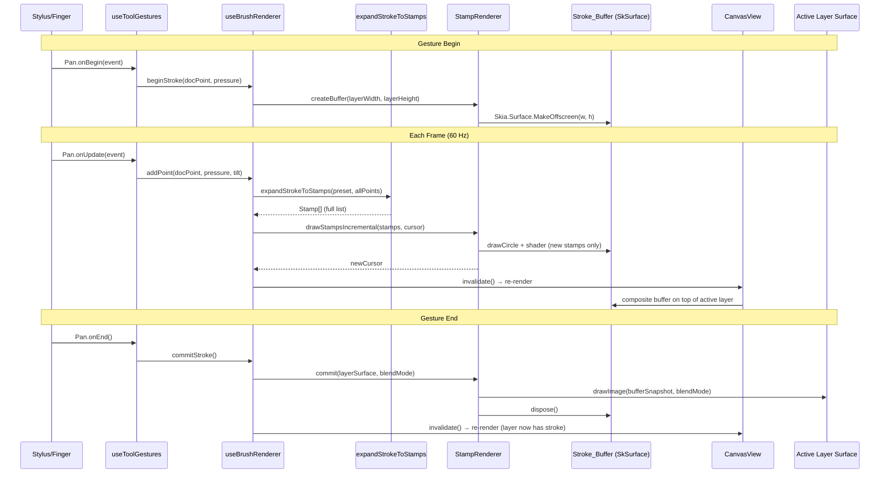
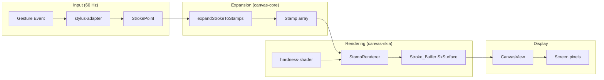

# brush-canvas-rendering — Design

> **Companion to:** `requirements.md`. **Type:** FEATURE — new rendering pipeline in `canvas-skia` + integration wiring in `apps/mobile`.
> **References:** `brush-system` (types, presets, stroke expansion), `editor-canvas-integration` (gesture capture, CanvasView), `canvas-fundamentals` (layer model, viewport).

## 1. Resolved Decisions

| ID | Decision |
|---|---|
| D1 | **StampRenderer lives in `libs/canvas-skia/src/brush/`** — it depends on Skia APIs and implements the render-adapter side of brush stamping. |
| D2 | **Stroke_Buffer is a single offscreen `SkSurface`** allocated once per gesture at active-layer dimensions. Reused across all frames of the gesture. |
| D3 | **Incremental rendering via a stamp cursor** — a numeric index tracks how many stamps have been drawn; each frame only draws stamps from cursor to end. |
| D4 | **Hardness falloff via radial gradient shader** — GPU-accelerated, not per-pixel JS. A pre-built `SkShader` with two stops (solid core → transparent edge) parameterized by hardness. |
| D5 | **Stylus adapter is a pure function module** in `libs/canvas-skia/src/input/` — maps raw gesture events to `StrokePoint` fields. No class, no state. |
| D6 | **Commit flattens buffer to layer via `drawImage`** — the stroke buffer's snapshot is drawn onto the layer's backing surface with the appropriate blend mode. |
| D7 | **CanvasView composites stroke buffer in `drawDocument`** — during an active stroke, the adapter draws the buffer on top of the active layer before flushing. |

## 2. Overview

This design adds the real-time Skia rendering pipeline that turns gesture-captured `StrokePoint[]` into visible pixels on the canvas. The pipeline has four stages:

```
┌─────────────┐     ┌──────────────────┐     ┌───────────────┐     ┌─────────────┐
│ Stylus/Touch│────▶│ expandStrokeToStamps │────▶│ StampRenderer │────▶│ CanvasView  │
│  Adapter    │     │   (canvas-core)      │     │ (canvas-skia) │     │ composite   │
└─────────────┘     └──────────────────┘     └───────────────┘     └─────────────┘
       │                                              │                      │
  raw events                                   Stroke_Buffer           frame output
  → StrokePoint[]                              (offscreen SkSurface)
```

**New code locations:**

| File | Package | Purpose |
|---|---|---|
| `src/brush/StampRenderer.ts` | `canvas-skia` | Core renderer: creates buffer, draws stamps, commits |
| `src/brush/hardness-shader.ts` | `canvas-skia` | Builds radial gradient shader for stamp hardness |
| `src/input/stylus-adapter.ts` | `canvas-skia` | Maps Apple Pencil / S-Pen events to StrokePoint |
| `src/screens/Editor/useBrushRenderer.ts` | `apps/mobile` | Hook: wires gesture → StampRenderer → CanvasView |

**Modified files:**

| File | Change |
|---|---|
| `libs/canvas-skia/src/adapter.ts` | Add `activeStrokeBuffer` field; composite it in `drawDocument` |
| `libs/canvas-skia/src/CanvasView.tsx` | Accept `strokeBuffer` prop; trigger re-render on buffer update |
| `libs/canvas-skia/src/index.ts` | Export new modules |
| `apps/mobile/src/screens/Editor/useToolGestures.ts` | Wire brush gesture to `useBrushRenderer` instead of placeholder |
| `apps/mobile/src/screens/Editor/CanvasArea.tsx` | Instantiate `useBrushRenderer`, pass buffer to CanvasView |

## 3. Architecture



### 3.1 Component Tree (post-integration)

```
EditorScreen
├── CanvasArea
│   ├── GestureDetector (useGestureCompositor)
│   │   └── CanvasView
│   │       └── [composites: layers + activeStrokeBuffer]
│   └── ZoomControls
├── useBrushRenderer (hook — owns StampRenderer lifecycle)
├── useToolGestures (modified — delegates to useBrushRenderer)
└── ...panels
```

## 4. Components and Interfaces

### 4.1 StampRenderer (canvas-skia)

The central class that manages the stroke buffer lifecycle and draws stamps using Skia GPU primitives.

```typescript
// libs/canvas-skia/src/brush/StampRenderer.ts

import type { Stamp } from '@diffusecraft/canvas-core';
import type { SkSurface, SkImage } from '@shopify/react-native-skia';

export interface StampRendererConfig {
  /** Active brush color as {r, g, b} in 0..1. */
  color: { r: number; g: number; b: number };
  /** Whether this stroke erases (DstOut) or paints (SrcOver). */
  erase: boolean;
  /** Whether the target is a mask layer (alpha-only rendering). */
  maskOnly: boolean;
}

export class StampRenderer {
  private buffer: SkSurface | null = null;
  private stampCursor: number = 0;
  private config: StampRendererConfig | null = null;

  /**
   * Create the stroke buffer. Called once at gesture begin.
   * Dimensions match the active layer (document-space pixels).
   */
  createBuffer(width: number, height: number, config: StampRendererConfig): void;

  /**
   * Draw stamps from `cursor` to end of the array. Returns the new cursor.
   * Only stamps at index >= cursor are drawn (incremental rendering).
   */
  drawStampsIncremental(stamps: ReadonlyArray<Stamp>, cursor: number): number;

  /**
   * Get a snapshot of the current buffer for compositing in CanvasView.
   * Returns null if no buffer is active.
   */
  getBufferSnapshot(): SkImage | null;

  /**
   * Commit: flatten the buffer onto the target layer surface using the
   * configured blend mode, then dispose the buffer.
   */
  commit(targetSurface: SkSurface): void;

  /** Dispose the buffer without committing (e.g., gesture cancelled). */
  dispose(): void;

  /** Whether a stroke is currently in progress. */
  get isActive(): boolean;
}
```

### 4.2 Hardness Shader (canvas-skia)

Builds a reusable radial gradient shader that implements the hardness falloff curve matching `composeStrokeIntoRaster`'s `stampCoverage` function.

```typescript
// libs/canvas-skia/src/brush/hardness-shader.ts

import type { SkShader } from '@shopify/react-native-skia';

/**
 * Build a radial gradient shader for a stamp with given hardness.
 *
 * - hardness=1: solid disc (alpha=1 everywhere inside radius)
 * - hardness=0: fully soft gradient (alpha=1 at center, 0 at edge)
 * - hardness=0.5: solid core at 50% radius, linear falloff to edge
 *
 * The shader is centered at (0,0) with radius 0.5 (normalized).
 * Callers scale via canvas transform to match stamp.size.
 */
export function buildHardnessShader(
  hardness: number,
  color: { r: number; g: number; b: number },
  opacity: number,
): SkShader;
```

### 4.3 Stylus Adapter (canvas-skia)

Pure functions that map raw gesture handler events to `StrokePoint` fields.

```typescript
// libs/canvas-skia/src/input/stylus-adapter.ts

import type { StrokePoint } from '@diffusecraft/canvas-core';

/** Default pressure for finger touches (no stylus data). */
export const DEFAULT_PRESSURE = 0.5;

export interface RawStylusEvent {
  x: number;
  y: number;
  /** Apple Pencil force (0..1) or undefined for finger. */
  force?: number;
  /** Apple Pencil azimuth in radians (0..2π). */
  azimuthAngle?: number;
  /** Apple Pencil altitude in radians (0..π/2). */
  altitudeAngle?: number;
  /** S-Pen pressure (0..1) or undefined. */
  pressure?: number;
}

/**
 * Map a raw stylus/touch event to a StrokePoint.
 *
 * - Apple Pencil: reads force → pressure, azimuth+altitude → tilt_x/tilt_y
 * - S-Pen: reads pressure directly
 * - Finger: uses DEFAULT_PRESSURE (0.5), no tilt
 *
 * FR-13: If pressure=0 on the first event (Apple Pencil bug), returns null
 * to signal the caller should discard this event.
 */
export function mapStylusEvent(
  event: RawStylusEvent,
  isFirstEvent: boolean,
): StrokePoint | null;

/**
 * Convert Apple Pencil azimuth (0..2π) and altitude (0..π/2) to
 * tilt_x and tilt_y in degrees (-90..90).
 *
 * tilt_x = cos(azimuth) * (90 - altitude_degrees)
 * tilt_y = sin(azimuth) * (90 - altitude_degrees)
 */
export function convertTilt(
  azimuthAngle: number,
  altitudeAngle: number,
): { tilt_x: number; tilt_y: number };

/**
 * Map raw pressure to [0, 1] with clamping.
 * Handles both Apple Pencil force and S-Pen pressure.
 */
export function mapPressure(rawValue: number | undefined): number;
```

### 4.4 useBrushRenderer Hook (apps/mobile)

Orchestrates the StampRenderer lifecycle within the React component tree.

```typescript
// apps/mobile/src/screens/Editor/useBrushRenderer.ts

import type { StrokePoint, BrushPreset } from '@diffusecraft/canvas-core';
import type { StampRenderer } from '@diffusecraft/canvas-skia';

export interface BrushRendererHandle {
  /** Start a new stroke. Creates the buffer. */
  beginStroke(config: {
    layerWidth: number;
    layerHeight: number;
    preset: BrushPreset;
    color: { r: number; g: number; b: number };
    erase: boolean;
    maskOnly: boolean;
  }): void;

  /** Add a point to the in-progress stroke. Triggers incremental render. */
  addPoint(point: StrokePoint): void;

  /** Commit the stroke to the active layer and dispose the buffer. */
  commitStroke(): void;

  /** Cancel the stroke without committing. */
  cancelStroke(): void;

  /** Whether a stroke is currently in progress. */
  readonly isActive: boolean;

  /** The StampRenderer instance (for CanvasView to read the buffer). */
  readonly renderer: StampRenderer;
}

export function useBrushRenderer(
  adapter: SkiaRenderAdapter | null,
): BrushRendererHandle;
```

### 4.5 CanvasView Modifications

The `CanvasView` component and `SkiaRenderAdapter` are extended to composite the active stroke buffer during rendering:

```typescript
// Addition to SkiaRenderAdapter.drawDocument():

// After drawing all layers, if an active stroke buffer exists,
// composite it on top of the active layer:
if (this.activeStrokeBuffer) {
  const snapshot = this.activeStrokeBuffer.getBufferSnapshot();
  if (snapshot) {
    const paint = Skia.Paint();
    // The buffer already contains the correct blend mode result
    // (SrcOver for paint, DstOut for erase was applied during stamping).
    // We composite the buffer itself with SrcOver onto the layer composite.
    paint.setBlendMode(BlendMode.SrcOver);
    canvas.drawImage(snapshot, 0, 0, paint);
  }
}
```

### 4.6 useToolGestures Modifications

The brush/eraser gesture handler is updated to delegate to `useBrushRenderer`:

```typescript
// Modified brush gesture in useToolGestures.ts:

.onBegin((e) => {
  const raw = extractRawStylusEvent(e);
  const point = mapStylusEvent(raw, /* isFirstEvent */ true);
  if (!point) return; // FR-13: discard pressure=0 first event

  const state = editorStore.getState();
  const layer = state.layers.find(l => l.id === state.activeLayerId);
  const preset = BRUSH_PRESETS[state.brush.preset ?? 'pen'];

  brushRenderer.beginStroke({
    layerWidth: state.document.width,
    layerHeight: state.document.height,
    preset: { ...preset, size: state.brush.size, opacity: state.brush.opacity },
    color: state.brush.color,
    erase: state.activeTool === 'eraser' || preset.erase,
    maskOnly: layer?.kind === 'mask',
  });

  brushRenderer.addPoint(point);
})
.onUpdate((e) => {
  const raw = extractRawStylusEvent(e);
  const point = mapStylusEvent(raw, /* isFirstEvent */ false);
  if (!point) return;
  brushRenderer.addPoint(point);
})
.onEnd(() => {
  brushRenderer.commitStroke();
})
```

## 5. Data Models

No new persistent data models. The pipeline operates on existing types from `canvas-core`:

| Type | Source | Role in this spec |
|---|---|---|
| `StrokePoint` | `canvas-core/brush/stroke.ts` | Input from gesture handler |
| `Stamp` | `canvas-core/brush/stamps.ts` | Output of `expandStrokeToStamps`, input to StampRenderer |
| `BrushPreset` | `canvas-core/brush/presets.ts` | Parameterizes stamp expansion |
| `Viewport` | `canvas-core/render/viewport.ts` | Screen→document coordinate conversion |

### Transient state (not persisted):

```typescript
/** Internal state of an in-progress stroke (lives in useBrushRenderer ref). */
interface ActiveStrokeState {
  /** Accumulated points since gesture begin. */
  points: StrokePoint[];
  /** The resolved preset (with store overrides applied). */
  preset: BrushPreset;
  /** How many stamps have been drawn so far (incremental cursor). */
  stampCursor: number;
  /** The StampRenderer config for this stroke. */
  config: StampRendererConfig;
}
```

### Data Flow



## 6. Correctness Properties

*A property is a characteristic or behavior that should hold true across all valid executions of a system — essentially, a formal statement about what the system should do. Properties serve as the bridge between human-readable specifications and machine-verifiable correctness guarantees.*

### Property 1: Incremental rendering equivalence

*For any* sequence of `StrokePoint[]` and any set of frame boundaries (arbitrary splits of the point sequence into batches), the union of stamps drawn incrementally across all frames SHALL equal the full `expandStrokeToStamps` result with no duplicates and no missing stamps.

**Validates: Requirements FR-2, FR-5**

### Property 2: Stamp coverage matches reference implementation

*For any* stamp parameters (size in [0.5, 200], hardness in [0, 1], position offset within radius), the coverage value produced by the Skia hardness shader at a given pixel offset SHALL match `composeStrokeIntoRaster`'s `stampCoverage` function within ±1/255 tolerance.

**Validates: Requirements FR-6**

### Property 3: Tilt conversion bounds

*For any* Apple Pencil azimuth angle in [0, 2π] and altitude angle in [0, π/2], the `convertTilt` function SHALL produce `tilt_x` and `tilt_y` values both within the range [-90, 90] degrees.

**Validates: Requirements FR-11**

### Property 4: Pressure mapping bounds

*For any* raw stylus input value (including undefined, 0, negative, and values > 1), the `mapPressure` function SHALL produce an output in [0, 1]. When the input is undefined, the output SHALL be `DEFAULT_PRESSURE` (0.5).

**Validates: Requirements FR-10, FR-12, FR-14**

### Property 5: Commit equivalence with reference

*For any* stroke (random points with random pressure/position, random preset from BUILTIN_PRESETS), the pixel data produced by committing the StampRenderer's buffer onto a blank layer SHALL match the output of `composeStrokeIntoRaster` applied to the same stamps on the same blank raster, within ±2/255 per-channel tolerance (accounting for GPU vs CPU floating-point differences).

**Validates: Requirements FR-15**

### Property 6: Sequential stroke compositing

*For any* sequence of N strokes (N in [2, 5]) committed to the same layer, the final pixel data SHALL equal the result of applying `composeStrokeIntoRaster` N times sequentially to the same initial raster. No stroke commit SHALL destroy or corrupt previously committed pixel data.

**Validates: Requirements FR-17**

### Property 7: Document-space coordinate invariance

*For any* viewport transform (zoom in [0.1, 10], pan in [-2000, 2000], rotation in [0, 360]) and any stamp position, the stamp SHALL be rendered at the same document-space coordinates regardless of viewport state. The viewport transform is applied only during final compositing to screen.

**Validates: Requirements FR-20**

## 7. Error Handling

| Scenario | Handling |
|---|---|
| `Skia.Surface.MakeOffscreen` returns null (GPU memory exhausted) | Log error, skip stroke rendering for this gesture. User sees no ink but app doesn't crash. On gesture end, no commit occurs. |
| Document dimensions are 0×0 (no document loaded) | `beginStroke` is a no-op. Guard at the hook level before calling renderer. |
| `expandStrokeToStamps` returns empty array (single point, spacing > distance) | Valid state — a single dot stamp is always emitted for the first point. If truly empty, no stamps are drawn. |
| Gesture cancelled (e.g., system interruption) | `onFinalize` calls `cancelStroke()` which disposes the buffer without committing. |
| Active layer is null or deleted mid-stroke | `commitStroke` checks layer existence; if missing, disposes buffer without commit. |
| Stylus reports invalid values (NaN, Infinity) | `mapStylusEvent` clamps all numeric values; NaN falls back to defaults. |
| Buffer dimensions exceed NFR-5 limit (>4096×4096) | Clip buffer to stroke bounding box + 64px padding instead of full document dimensions. Recalculated on first `addPoint`. |

## 8. Testing Strategy

**Testing is deferred** per `.kiro/steering/testing.md`. No test files are created in this spec.

**Property-based testing IS applicable** for this spec. The core rendering logic involves pure functions (`mapStylusEvent`, `convertTilt`, `mapPressure`, `buildHardnessShader` coverage calculation) and deterministic state machines (incremental stamp cursor) that have clear input/output behavior and universal properties.

**When testing resumes (end of v1):**

- **PBT library:** `fast-check` (already available in the monorepo's dev dependencies)
- **Minimum iterations:** 100 per property test
- **Tag format:** `Feature: brush-canvas-rendering, Property {N}: {title}`

**Property tests to implement:**
1. Incremental rendering equivalence — generate random point sequences, split at random frame boundaries, verify stamp sets match
2. Stamp coverage equivalence — generate random (size, hardness, offset) tuples, compare shader output vs `stampCoverage` reference
3. Tilt conversion bounds — generate random (azimuth, altitude) pairs, verify output range
4. Pressure mapping bounds — generate arbitrary numbers + undefined, verify [0, 1] output
5. Commit equivalence — generate random strokes, compare GPU commit vs CPU `composeStrokeIntoRaster`
6. Sequential compositing — generate N random strokes, verify sequential commit matches sequential `composeStrokeIntoRaster`
7. Document-space invariance — generate random viewports + stamp positions, verify stamp coordinates are viewport-independent

**Unit tests (example-based):**
- StampRenderer lifecycle: create → draw → commit → dispose
- Blend mode selection: paint=SrcOver, erase=DstOut
- Mask layer alpha-only rendering
- Apple Pencil pressure=0 first-event discard (FR-13)
- Preset switching between strokes (FR-19)
- Buffer clipping for large documents (NFR-5)

**Verification during implementation** (current phase):
- TypeScript compiles (`nx typecheck canvas-skia`, `nx typecheck mobile`)
- Manual run on iPad simulator with Apple Pencil simulation
- Visual inspection: strokes appear in real-time, pressure modulates width, eraser removes pixels
- Performance profiling: verify ≤30ms latency on iPad Pro M-class
