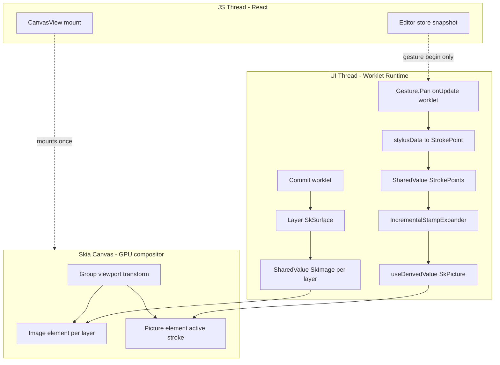
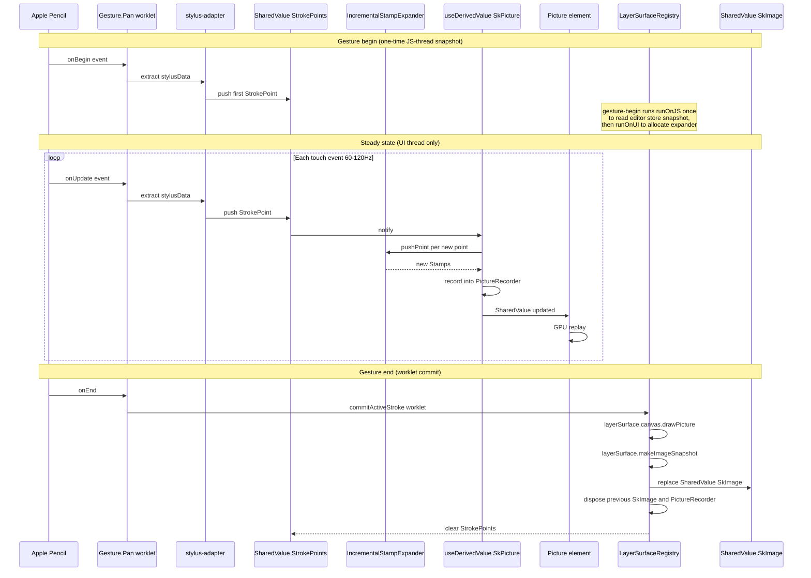

# Technical Design: brush-canvas-rendering

## Overview

This design delivers a Procreate-grade brush rendering architecture for the DiffuseCraft tablet client. **Each paint layer owns a persistent GPU-backed `SkSurface` that is the source of truth for its pixels**, exposed to the visible canvas as a `SharedValue<SkImage | null>` rendered through a single `<Image>` element. **The active in-progress stroke is a transient `SkPicture` re-recorded each frame inside a `useDerivedValue` from a `SharedValue<StrokePoint[]>`**, displayed by a single `<Picture>` element overlaid on the layer images. **On `onEnd`, a worklet replays the active picture onto the layer's surface, snapshots it into the layer's `SharedValue<SkImage>`, and disposes the picture.** Stylus data (Apple Pencil `force` / azimuth / altitude, S-Pen `pressure`) reaches the worklet through `react-native-gesture-handler` 2.20+'s `event.stylusData` field on `Gesture.Pan`, with `runOnJS` removed so the entire hot path stays on the UI thread.

The design **replaces and removes** the existing `SkPicture[]`-based implementation in `libs/canvas-skia/src/brush/StampRenderer.ts`, `libs/canvas-skia/src/adapter.ts`, `libs/canvas-skia/src/CanvasView.tsx`, `apps/mobile/src/screens/Editor/useBrushRenderer.ts`, and `apps/mobile/src/screens/Editor/useToolGestures.ts`, including the dead `SkiaRenderAdapter.drawDocument` path, the placeholder `rasterizeDocument`, and the `committedPictures: SkPicture[]` retention model. There is no parallel-old-and-new path; the cutover is wholesale (P25).

The brush engine itself stays minimal in v1: round soft alpha disc with linear hardness falloff via radial gradient + basic pressure-to-size/opacity mapping. Tip textures, tilt-to-stamp-rotation, scatter, dual-brush, smudge, and predictive smoothing are explicitly deferred to a future `brush-engine-procreate` spec.

### Goals

- Touch-event-to-pixel latency ≤ 30 ms on iPad Pro M-class.
- Sustained 60 fps for strokes up to 2000 stamps and for layers with 1000+ committed strokes.
- Zero JS-bridge crossings between hardware touch event and pixel write in the steady-state hot path.
- Bounded native memory: one `SkImage` per visible layer + at most one transient `SkPicture` per active stroke.
- Clean cutover from the legacy `SkPicture[]` retention model — no half-finished paths remain.

### Non-Goals

- Tip textures / tip atlas (deferred to `brush-engine-procreate`).
- Tilt-to-stamp-rotation rendering (deferred).
- Scatter, dual-brush, smudge brushes (deferred).
- Predictive / spline smoothing (Catmull-Rom, cardinal). Existing moving-average kept.
- Server-side stroke materialization (handled by `client-sdk`).
- Undo/redo wiring (consumed by `undo-redo-system`; this spec only exposes commit hooks and per-layer pixel reads).

## Boundary Commitments

### This Spec Owns

- The **per-layer raster lifecycle**: `SkSurface` allocation, snapshot to `SharedValue<SkImage>`, image disposal on replacement.
- The **active stroke pipeline**: `SharedValue<StrokePoint[]>`, the incremental stamp expander, the `useDerivedValue<SkPicture>` that re-records the active stroke, and the commit step that flattens onto the layer surface.
- The **stylus input adapter**: extraction of `pressure` / `tiltX` / `tiltY` / `azimuthAngle` / `altitudeAngle` from `event.stylusData`, fallback to default pressure for finger touches, first-event force=0 guard.
- The **rendered visual hierarchy** inside `<Canvas>`: paper rect, per-layer `<Image>`, active stroke `<Picture>` overlay, viewport `<Group>` transform.
- The **wholesale removal** of the legacy `SkPicture[]` retention path, dead `drawDocument`, and stub `rasterizeDocument`.

### Out of Boundary

- Layer model itself (id, kind, opacity, blend mode) — owned by `canvas-fundamentals`.
- Brush preset definitions and stroke-type contracts — owned by `brush-system` (Phase A+B already implemented).
- Editor store, gesture surface, viewport state — owned by `editor-canvas-integration` and `client-state-architecture`.
- Per-layer undo snapshot capture — owned by `undo-redo-system`. This spec exposes a commit event and a synchronous layer-image read; the consumer subscribes.
- Server-side persistence and materialization — owned by `client-sdk` and `brush-system` (`paint_strokes` MCP tool).
- Tip textures, scatter, dual-brush, smudge, predictive smoothing — deferred to `brush-engine-procreate`.
- Document-level export (multi-layer flatten + encode) — separate concern.

### Allowed Dependencies

| Source | Use |
|--------|-----|
| `@shopify/react-native-skia` 2.6.x | Surface, Picture, Image, Paint, Shader, Canvas, hooks |
| `react-native-gesture-handler` 2.20+ (installed: 2.30.x) | `Gesture.Pan` with `event.stylusData` |
| `react-native-reanimated` 3+ (installed: 4.2.1) | `SharedValue`, `useDerivedValue`, `runOnUI`, worklet runtime |
| `@diffusecraft/canvas-core` | `Stamp`, `StrokePoint`, `BrushPreset`, `samplePressureCurve`, the existing `expandStrokeToStamps` (kept for server-side parity) |
| `@diffusecraft/core` | editor store slices (active tool, brush color/size/opacity/hardness, active layer, viewport) — **read at gesture-begin only**, never polled mid-stroke |

### Revalidation Triggers

The following changes force a re-check of dependent specs (`undo-redo-system`, `client-sdk`, `editor-canvas-integration`, future `brush-engine-procreate`):

- **Contract shape change**: any change to the `LayerSurfaceRegistry` public API, the commit event payload, or the `IncrementalStampExpander` factory signature.
- **Pixel-data ownership change**: any change to who owns the layer's `SkSurface`, `SkImage`, or pixel-snapshot timing.
- **Dependency direction change**: introducing a new dependency from `canvas-skia` into `apps/mobile` or `core` (forbidden by P20).
- **Runtime prerequisite change**: bumping the minimum versions of RNGH (currently 2.20+) or Reanimated (currently 3+).
- **Stylus data shape change**: extending `StrokePoint` with new fields (e.g., rollAngle for Apple Pencil Pro) — would require coordinated changes in `brush-system`.

## Architecture

### Existing Architecture Analysis

The current implementation is wholesale replaced. Specifically:

| Existing artifact | Disposition |
|---|---|
| `SkiaRenderAdapter.drawDocument` (`adapter.ts:179`) | **Removed.** Was never invoked; dead code. |
| `SkiaRenderAdapter.committedPictures: SkPicture[]` (`adapter.ts:69`) | **Removed.** Replaced by per-layer `SkSurface` in the new `LayerSurfaceRegistry`. |
| `SkiaRenderAdapter.rasterizeDocument` (`adapter.ts:247`) | **Removed.** Replaced by `LayerSurfaceRegistry.readLayerImage(layerId)`. |
| `StampRenderer` chunked-Picture model (`StampRenderer.ts:64-249`) | **Rewritten.** New `StampRenderer` records the active stroke into a single `PictureRecorder`; chunking is dropped (the active stroke is short-lived and disposed at commit). |
| `useBrushRenderer.ts` JS-thread orchestration | **Replaced** by `useBrushPipeline.ts` (worklet-driven). Old file deleted. |
| `useToolGestures.ts` brush gesture with `.runOnJS(true)` | **Modified.** `runOnJS` removed; gesture body becomes a worklet that reads `event.stylusData` and writes to `SharedValue<StrokePoint[]>`. |
| `EMPTY_PICTURE` sentinel + `SharedValue<SkPicture>` plumbing in `CanvasView.tsx` | **Removed.** Replaced by `SharedValue<SkImage>` per layer + a single `SharedValue<SkPicture>` for the active stroke. |
| `libs/canvas-skia/src/brush/hardness-shader.ts` | **Kept** — still used; the radial gradient builder is unchanged. |
| `libs/canvas-skia/src/input/stylus-adapter.ts` | **Adapted.** Same pure-function shape; rewired to consume `event.stylusData` instead of bespoke shapes. |
| `libs/canvas-skia/src/blend.ts`, `image-cache.ts`, `viewport-canvas.ts`, overlays | **Kept.** Not on the brush hot path. `image-cache` retains image-by-blob-id cache for control-layer / generation-history images; it does not store stroke pixels. |

### Architecture Pattern & Boundary Map



**Key decisions** (not restating the diagram):

- **Selected pattern**: hybrid renderer — committed pixels in `SkSurface` per layer, in-progress stroke in transient `SkPicture` re-recorded each frame.
- **Domain seam**: `canvas-core` owns brush math (pure TS); `canvas-skia` owns surfaces/pictures/images and the worklet pipeline; `apps/mobile` owns the gesture binding and editor-store integration. Dependency direction is `canvas-core ← canvas-skia ← apps/mobile`; reverse imports are forbidden by `@nx/enforce-module-boundaries` (P20).
- **Steering compliance**: P22 (tablet-first), P25 (no half-finished — wholesale cutover), P26 (no client inference — engine is pure render), P27 (universal undo/redo — exposes commit + read APIs the consumer subscribes to).

### Technology Stack

| Layer | Choice / Version | Role | Notes |
|---|---|---|---|
| Frontend graphics | `@shopify/react-native-skia` 2.6.2 | Canvas, Surface, Picture, Image, Paint, Shader | `MakeOffscreen` callable from worklets; reactive `<Image image={shared}>` documented |
| Frontend gestures | `react-native-gesture-handler` ~2.30.0 | `Gesture.Pan` + `event.stylusData` | Auto-workletized when Reanimated installed; `.runOnJS(true)` is forbidden |
| Frontend state | `react-native-reanimated` 4.2.1 | `SharedValue`, `useDerivedValue`, `runOnUI` | Worklet runtime; SharedValue subscriptions bypass React renders |
| Brush math | `@diffusecraft/canvas-core` (workspace) | Stamp / pressure / smoothing types and pure expansion | Reused; new incremental factory added |
| Editor state | `@diffusecraft/core` (workspace) | Editor store factory + selectors | Read once at gesture-begin only |

## File Structure Plan

### New files

```
libs/canvas-core/src/brush/
├── incremental-stroke.ts        # NEW: worklet-shareable factory for incremental stamp expansion
└── (existing: stamps.ts, presets.ts, stroke.ts, compose-stroke.ts unchanged)

libs/canvas-skia/src/
├── brush/
│   ├── StampRenderer.ts          # REWRITTEN: PictureRecorder for active stroke; pool Paint+Shader
│   ├── LayerSurfaceRegistry.ts   # NEW: per-layer SkSurface + SharedValue<SkImage> lifecycle
│   ├── commit-worklet.ts         # NEW: worklet that replays active picture onto layer surface and snapshots
│   └── hardness-shader.ts        # KEPT
├── input/
│   ├── stylus-adapter.ts         # ADAPTED: consume RNGH event.stylusData shape
│   └── stylusData-types.ts       # NEW: TS types for the relevant subset of RNGH stylus payload
├── adapter.ts                    # SLIMMED: hosts LayerSurfaceRegistry; drawDocument removed; rasterizeDocument removed
├── CanvasView.tsx                # REWRITTEN: per-layer <Image> chain + active <Picture> overlay
└── index.ts                      # MODIFIED: new exports

apps/mobile/src/screens/Editor/
├── useBrushPipeline.ts           # NEW: replaces useBrushRenderer.ts (worklet-driven)
├── useToolGestures.ts            # MODIFIED: brush gesture rewritten without .runOnJS(true)
└── (useBrushRenderer.ts          # DELETED)
```

### Modified files

- `libs/canvas-core/src/index.ts` — export `createIncrementalStampExpander` and its types.
- `libs/canvas-skia/src/index.ts` — export `LayerSurfaceRegistry`, the new `StampRenderer`, `useLayerImage` hook (if used), and removed-export entries for the deleted symbols.
- `libs/canvas-skia/src/blend.ts`, `image-cache.ts`, `viewport-canvas.ts`, overlays — unchanged.
- `apps/mobile/src/screens/Editor/CanvasArea.tsx` — wires `useBrushPipeline` instead of `useBrushRenderer`.

### Removed files / paths

- `apps/mobile/src/screens/Editor/useBrushRenderer.ts` — replaced.
- `SkiaRenderAdapter.drawDocument`, `committedPictures`, `committedPictureCache`, `getCommittedPicture`, `getActiveStrokePicture`, `setActiveStrokeBuffer`, `commitActiveStroke`, `clearActiveStrokeBuffer`, `rebuildCommittedCache`, `rasterizeDocument` — removed from `adapter.ts`.
- `EMPTY_PICTURE` sentinel — removed (display path no longer needs a picture sentinel; `<Picture>` is conditionally mounted only when a stroke is active).

## System Flows

### Stroke lifecycle (worklet hot path)



**Decisions captured by the diagram:**

- The only JS-thread work during a stroke is the **one-time read of editor store at `onBegin`** (preset, color, active layer, viewport). After that, every touch event lives on the UI thread.
- Commit is a single worklet call: `drawPicture` + `makeImageSnapshot` + `SharedValue` swap + dispose. No JS thread involvement.
- The active `<Picture>` is conditionally rendered: visible during a stroke, unmounted at commit (no empty-picture sentinel needed).

### Simulator fallback branch

If `Platform.OS === 'ios'` and the runtime detects iOS Simulator, the commit worklet uses `surface.makeImageSnapshotAsync()` (already supported by RN-Skia 2.6.x) instead of the synchronous `makeImageSnapshot()`. The async variant awaits flush completion and is robust against the historical simulator flakiness recorded in RN-Skia issue #1811. The selected path (`gpu-sync` / `gpu-async-simulator` / `cpu-fallback`) is logged once at session start.

## Requirements Traceability

| Req | Summary | Components | Interfaces / Flows |
|---|---|---|---|
| 1.1, 1.7 | Per-layer persistent SkSurface | `LayerSurfaceRegistry` | `getOrCreateSurface(layerId)`, `readLayerImage(layerId)` |
| 1.2, 1.5 | Stroke buffer per gesture, dispose on cancel | `StampRenderer` | `beginStroke`, `cancelStroke` |
| 1.3 | Active stamps land on stroke buffer only | `useDerivedValue<SkPicture>` in `useBrushPipeline` | Stroke lifecycle diagram |
| 1.4 | Commit replays buffer onto layer surface w/ blend | `commit-worklet.ts`, `LayerSurfaceRegistry.commitPictureToLayer` | `commitPictureToLayer(layerId, picture, blendMode)` |
| 1.6 | No SkPicture[] inter-stroke retention | architectural constraint, enforced by removal of `committedPictures` and code review | n/a |
| 2.1, 2.2, 2.5, 2.6 | UI-thread hot path, no `runOnJS(true)` | `useToolGestures` brush gesture, `useBrushPipeline` | gesture binding without `.runOnJS(true)`; lint rule |
| 2.3, 2.4 | No React renders during stroke; `<Canvas>` mounted once | `CanvasView` lazy ref + once-only effect | n/a |
| 3.1, 3.2, 3.4, 3.5 | Stateful incremental expansion, O(new stamps) | `IncrementalStampExpander` | `pushPoint(p) → Stamp[]`, `dispose()` |
| 3.3 | Worklet-callable expander | `IncrementalStampExpander` factory shape | plain object + worklet-marked methods |
| 4.1, 4.2, 4.3, 4.4 | One Paint + one Shader per stroke | `StampRenderer` per-stroke pool | `beginStroke`, `endStroke` |
| 5.1, 5.2, 5.3, 5.4 | Round soft alpha disc with hardness falloff | `hardness-shader.ts` (kept) | `buildHardnessShader(hardness, color, opacity)` |
| 5.5, 5.6, 5.7 | Paint / erase / mask blend modes | `StampRenderer` config + commit worklet | `StampRendererConfig.erase / maskOnly` |
| 6.1, 6.2, 6.3, 6.6 | Stylus data via RNGH 2.20+ on UI thread | `stylus-adapter.ts` (adapted), `useToolGestures` brush gesture | `mapStylusData(event)` worklet |
| 6.4, 6.5 | Force=0 first-event guard, finger fallback 0.5 | `stylus-adapter.ts` | `mapStylusData` |
| 7.1, 7.2, 7.3, 7.4 | Brush preset read at begin, immutable mid-stroke | `useBrushPipeline.beginStroke` | `BeginStrokeConfig` |
| 8.1, 8.2, 8.3, 8.4 | Document-space rendering at full layer resolution | `CanvasView` viewport `<Group>`, layer surfaces sized to layer | viewport `<Group>` transform |
| 9.1, 9.2 | Latency / throughput | architectural — verified on device | n/a |
| 9.3, 9.4 | Memory bounding (per-layer image; bbox clip > 4096) | `LayerSurfaceRegistry` allocation policy | `getOrCreateSurface(layerId, dims)` |
| 9.5 | One image per layer per frame | `CanvasView` `<Image>` per layer | n/a |
| 9.6 | Native handle release | `LayerSurfaceRegistry.disposeLayer`, `StampRenderer.endStroke` | dispose hooks |
| 10.1, 10.2, 10.3, 10.4, 10.5 | Sim/device fallback policy + log | `commit-worklet.ts` simulator branch | `Platform.constants` detection |
| 11.1–11.6 | Wholesale removal of legacy paths | Multiple `Modified` and `Removed` entries in File Structure Plan | n/a |
| 12.1, 12.2, 12.3, 12.4 | Snapshot read API for undo/redo + commit event | `LayerSurfaceRegistry.readLayerImage`, `subscribeCommit` | exposed below |

## Components and Interfaces

### Component summary

| Component | Domain / Layer | Intent | Req coverage | Key dependencies (P0/P1) | Contracts |
|---|---|---|---|---|---|
| `IncrementalStampExpander` | `canvas-core/brush` | Worklet-shareable, stateful per-stroke stamp emission | 3.1, 3.2, 3.3, 3.4, 3.5, 7.4 | `samplePressureCurve` (P0) | Service, State |
| `StampRenderer` (rewritten) | `canvas-skia/brush` | Per-stroke `PictureRecorder` + Paint/Shader pool, draws stamps | 1.2, 1.3, 1.5, 4.1, 4.2, 4.3, 4.4, 5.1–5.7 | `Skia` (P0), `IncrementalStampExpander` (P0), `hardness-shader` (P0) | Service, State |
| `LayerSurfaceRegistry` | `canvas-skia/brush` | Per-layer `SkSurface` + `SharedValue<SkImage>` lifecycle, commit, snapshot read | 1.1, 1.4, 1.7, 9.3, 9.4, 9.6, 10.1, 10.2, 10.5, 12.1, 12.2, 12.3, 12.4 | `Skia.Surface` (P0), Reanimated `SharedValue` (P0) | Service, State, Event |
| `commit-worklet` | `canvas-skia/brush` | The single worklet function invoked at `onEnd` to flatten | 1.4, 9.6, 10.2, 12.1 | `LayerSurfaceRegistry` (P0) | Service |
| `stylus-adapter` (adapted) | `canvas-skia/input` | Pure functions mapping `event.stylusData` to `StrokePoint` | 6.2, 6.3, 6.4, 6.5 | none | Service |
| `CanvasView` (rewritten) | `canvas-skia` | Mounts `<Canvas>` once; per-layer `<Image>` chain + active `<Picture>` | 1.3, 1.7, 2.3, 2.4, 8.1, 8.2, 9.5 | RN-Skia (P0), `LayerSurfaceRegistry` (P0) | UI |
| `SkiaRenderAdapter` (slimmed) | `canvas-skia` | Hosts `LayerSurfaceRegistry`; image cache (control layers) and overlays kept | 1.1, 11.1, 11.2, 11.3, 11.4 | `LayerSurfaceRegistry` (P0) | Service |
| `useBrushPipeline` | `apps/mobile/Editor` | React hook orchestrating `IncrementalStampExpander` + `StampRenderer` + `useDerivedValue<SkPicture>` + commit | 2.1, 2.5, 3.3, 7.1, 7.2, 7.3 | RNGH (P0), Reanimated (P0), `StampRenderer` (P0), `LayerSurfaceRegistry` (P0) | Hook |
| `useToolGestures` brush gesture | `apps/mobile/Editor` | `Gesture.Pan` worklet calling pipeline; reads `stylusData` | 2.1, 2.2, 6.1, 6.6, 11.5 | RNGH (P0), `useBrushPipeline` (P0) | Hook |

### canvas-core layer

#### IncrementalStampExpander

| Field | Detail |
|---|---|
| Intent | Stateful, worklet-callable, per-stroke factory that emits stamps incrementally as new points arrive |
| Requirements | 3.1, 3.2, 3.3, 3.4, 3.5, 7.4 |

**Responsibilities & Constraints**
- Owns per-stroke state: last consumed input index, last emitted stamp position, distance traveled in current segment, prior smoothed point.
- Emits only the stamps falling on the segment from the last emitted stamp to the new point.
- Worklet-shareable: factory returns a plain object with worklet-marked methods; closures over non-shareable references are forbidden.
- Reuses spacing math + `samplePressureCurve` from existing `canvas-core/brush/stamps.ts` (kept untouched for server-side parity).

**Dependencies**
- Outbound: `samplePressureCurve` from `canvas-core/brush/stroke` (P0).
- Inbound: invoked by `useBrushPipeline` at gesture begin and by `useDerivedValue<SkPicture>` at every touch event.

**Contracts**: Service [x] / State [x]

##### Service interface

```typescript
// libs/canvas-core/src/brush/incremental-stroke.ts

import type { BrushPreset, Stamp, StrokePoint } from './';

export interface IncrementalStampExpanderConfig {
  readonly preset: BrushPreset;
  /** Smoothing factor [0, 0.95]. Defaults to 0.3. */
  readonly smoothing?: number;
  /** Optional overrides matching ExpandStrokeOptions semantics. */
  readonly sizeOverride?: number;
  readonly opacityOverride?: number;
}

export interface IncrementalStampExpander {
  /**
   * Push the next captured input point. Returns the stamps that should be
   * drawn for this point (typically 0..N depending on segment length and
   * preset spacing). Worklet-callable: methods are worklet-marked and the
   * object holds only primitives + arrays of primitives in shared state.
   */
  pushPoint(point: StrokePoint): Stamp[];
  /** Total stamps emitted so far. Used by tests and diagnostics. */
  readonly emittedCount: number;
  /** Release per-stroke state. Idempotent. */
  dispose(): void;
}

export function createIncrementalStampExpander(
  config: IncrementalStampExpanderConfig,
): IncrementalStampExpander;
```

- **Preconditions**: `config.preset.spacing > 0`, `config.preset.size > 0`.
- **Postconditions**: For any prefix-shared input sequence, the union of stamps emitted across `pushPoint` calls equals `expandStrokeToStamps(preset, points, options)` over that same sequence (validated by property-test when tests are re-enabled).
- **Invariants**: `pushPoint` is O(1) amortized in the number of new stamps emitted; never re-walks consumed points.

**Implementation Notes**
- Integration: `useBrushPipeline.beginStroke` constructs the expander; `useDerivedValue<SkPicture>` calls `pushPoint` for each new entry of `SharedValue<StrokePoint[]>`.
- Validation: a property test (deferred per `testing.md`) compares the incremental output against the pure-function `expandStrokeToStamps` for randomized inputs.
- Risks: smoothing-state divergence between incremental and pure variants. Mitigation: identical math copied + tested in parallel.

### canvas-skia layer

#### StampRenderer (rewritten)

| Field | Detail |
|---|---|
| Intent | Renders stamps for the current stroke into a single `SkPictureRecorder`; owns the per-stroke `SkPaint` + `SkShader` pool |
| Requirements | 1.2, 1.3, 1.5, 4.1, 4.2, 4.3, 4.4, 5.1, 5.2, 5.3, 5.4, 5.5, 5.6, 5.7 |

**Responsibilities & Constraints**
- Allocates exactly one `SkPaint` and (for the active hardness/color) one `SkShader` at `beginStroke`. Reuses both for every stamp.
- Records stamps into a single `SkPictureRecorder` for the stroke's life. The picture is finalized on demand by `getActivePicture()` (called from inside the `useDerivedValue`); successive calls re-record from scratch into a new recorder, so the picture is always fresh and never mutated after finalization.
- Disposes paint + shader + recorder on `endStroke` / `cancelStroke`.

**Dependencies**
- Outbound: `Skia.PictureRecorder`, `Skia.Paint`, `hardness-shader.ts:buildHardnessShader` (P0).
- Inbound: `useDerivedValue<SkPicture>` inside `useBrushPipeline`.

**Contracts**: Service [x] / State [x]

##### Service interface

```typescript
// libs/canvas-skia/src/brush/StampRenderer.ts

import type { Stamp } from '@diffusecraft/canvas-core';
import type { SkPicture } from '@shopify/react-native-skia';

export interface StampRendererConfig {
  readonly width: number;     // layer / stroke-bbox width (document-space)
  readonly height: number;    // layer / stroke-bbox height
  readonly color: { r: number; g: number; b: number };
  readonly hardness: number;  // [0, 1]
  readonly erase: boolean;
  readonly maskOnly: boolean;
}

export interface StampRenderer {
  /** Allocate paint + shader + open the recorder. Worklet-callable. */
  beginStroke(config: StampRendererConfig): void;
  /** Append stamps to the open recorder. Worklet-callable. O(stamps). */
  drawStamps(stamps: ReadonlyArray<Stamp>): void;
  /**
   * Finalize the recorder, return the resulting Picture, and immediately
   * open a fresh recorder for further appends. The previous Picture handle
   * is invalidated for further mutation but remains valid for replay until
   * the caller releases it.
   */
  takePicture(): SkPicture;
  /** Dispose paint + shader + active recorder. Idempotent. */
  endStroke(): void;
  readonly isActive: boolean;
}

export function createStampRenderer(): StampRenderer;
```

- **Preconditions for `drawStamps`**: `beginStroke` was called and `endStroke` was not yet called.
- **Postconditions for `takePicture`**: returned `SkPicture` is a snapshot of every `drawStamps` call since `beginStroke`; the recorder is reset and ready for further `drawStamps`.
- **Invariants**: at most one `SkPaint` + one `SkShader` per stroke, regardless of stamp count (Req 4.1, 4.2).

**Implementation Notes**
- Integration: invoked from inside the `useDerivedValue` worklet on every `SharedValue<StrokePoint[]>` change.
- Validation: assert at runtime that `beginStroke` is not called twice without a `endStroke` between (worklet-side `__DEV__` invariant).
- Risks: `takePicture` is called per touch event; cost is one `finishRecordingAsPicture` + one `beginRecording`. Validated by spike on physical device.

#### LayerSurfaceRegistry

| Field | Detail |
|---|---|
| Intent | Owns the per-layer persistent `SkSurface`, derives a `SharedValue<SkImage>` for display, exposes commit + snapshot-read APIs |
| Requirements | 1.1, 1.4, 1.7, 9.3, 9.4, 9.6, 10.1, 10.2, 10.5, 12.1, 12.2, 12.3, 12.4 |

**Responsibilities & Constraints**
- Lazily allocates one `SkSurface` per paint layer at the layer's full document dimensions. Layers larger than 4096×4096 are deferred per Req 9.4 — the surface is allocated at layer dimensions, but the stroke pipeline clips the active picture to the stroke's running bounding box plus padding before commit.
- Maintains a parallel `SharedValue<SkImage | null>` per layer. Initial value is `null` (empty layer). Each commit replaces the value with a fresh snapshot and disposes the prior `SkImage`.
- Exposes a worklet-side commit function (`commitPictureToLayer`) and a JS-thread synchronous snapshot read (`readLayerImage`) for undo/redo consumers.
- Emits a `commit` event so consumers (undo/redo, server materialization) can subscribe; the registry does not itself push state to those consumers.
- On layer removal, releases the surface and the latest `SkImage`.

**Dependencies**
- Outbound: `Skia.Surface.MakeOffscreen`, `Skia.Surface.makeImageSnapshot` / `makeImageSnapshotAsync`, Reanimated `SharedValue` factory (P0).
- Inbound: `commit-worklet`, `useBrushPipeline.commitStroke`, `CanvasView`, `undo-redo-system` (per Req 12).

**Contracts**: Service [x] / State [x] / Event [x]

##### Service interface

```typescript
// libs/canvas-skia/src/brush/LayerSurfaceRegistry.ts

import type { LayerId } from '@diffusecraft/canvas-core';
import type { BlendMode, SkImage, SkPicture, SkSurface } from '@shopify/react-native-skia';
import type { SharedValue } from 'react-native-reanimated';

export interface LayerCommitEvent {
  readonly layerId: LayerId;
  /** Document-space bbox of the dirtied region. */
  readonly bbox: { readonly x: number; readonly y: number; readonly w: number; readonly h: number };
  /** Monotonic counter incremented per commit per layer. */
  readonly seq: number;
}

export interface LayerSurfaceRegistry {
  /**
   * Allocate or return the SkSurface for the given layer. Idempotent.
   * Dimensions are determined at first allocation from the layer's bounds.
   */
  getOrCreateSurface(layerId: LayerId, width: number, height: number): SkSurface;
  /**
   * The reactive SkImage handle the visible <Image> subscribes to.
   * Initialized to null until the first commit. Replacement disposes the
   * prior SkImage.
   */
  imageFor(layerId: LayerId): SharedValue<SkImage | null>;
  /**
   * Worklet-callable: replay the picture onto the layer surface using the
   * given blend mode, snapshot the surface into the layer's SharedValue
   * SkImage, dispose the previous SkImage. Emits a commit event.
   */
  commitPictureToLayer(
    layerId: LayerId,
    picture: SkPicture,
    blendMode: BlendMode,
    bbox: { x: number; y: number; w: number; h: number },
  ): void;
  /**
   * JS-thread synchronous read: return the current SkImage for a layer
   * (a fresh handle). Caller is responsible for disposing.
   * Used by undo-redo-system snapshot capture.
   */
  readLayerImage(layerId: LayerId): SkImage | null;
  /** Subscribe to commit events. Returns an unsubscribe function. */
  subscribeCommit(listener: (e: LayerCommitEvent) => void): () => void;
  /** Release surface + latest SkImage for a removed layer. Idempotent. */
  disposeLayer(layerId: LayerId): void;
  /** Release every surface and image. Called on editor teardown. */
  disposeAll(): void;
}

export function createLayerSurfaceRegistry(opts: {
  /** Optional simulator-detection injection (defaults to runtime detection). */
  isSimulator?: () => boolean;
}): LayerSurfaceRegistry;
```

##### Event contract

- **Published**: `LayerCommitEvent` per commit.
- **Ordering**: per-layer monotonic `seq`; cross-layer ordering is the order of commit calls.
- **Delivery**: synchronous within the commit worklet's continuation on the UI thread; subscribers are invoked through `runOnJS` to land back on the JS thread (this is the only acceptable JS-bridge crossing per gesture, and it happens at gesture end, not in the hot path).

##### State management

- **State model**: `Map<LayerId, { surface: SkSurface; image: SharedValue<SkImage|null>; latestImage: SkImage|null; seq: number }>`.
- **Persistence**: in-memory only; survives the editor session. Persisted by `client-sdk` separately.
- **Concurrency**: only the UI thread mutates surface contents; the JS thread only reads via `readLayerImage`. No locks needed because Skia handles GPU command serialization.

**Implementation Notes**
- Integration: `SkiaRenderAdapter` constructs and holds the registry; `CanvasView` reads `imageFor(layerId)` per visible layer; `useBrushPipeline` calls `getOrCreateSurface` at gesture begin and `commitPictureToLayer` at gesture end.
- Validation: dev-only invariant that `commitPictureToLayer` is only called from a worklet; a `__DEV__` check throws if called from JS.
- Risks: `SkImage` disposal timing — the SharedValue replacement must dispose the *old* image, not the new one. Handled by capturing the prior reference before assignment.

#### commit-worklet

| Field | Detail |
|---|---|
| Intent | The single worklet function called at `onEnd`/`commitStroke` to flatten the active picture onto the layer surface and snapshot |
| Requirements | 1.4, 9.6, 10.2, 12.1 |

##### Service interface

```typescript
// libs/canvas-skia/src/brush/commit-worklet.ts

import type { BlendMode, SkPicture } from '@shopify/react-native-skia';
import type { LayerId } from '@diffusecraft/canvas-core';
import type { LayerSurfaceRegistry } from './LayerSurfaceRegistry';

export interface CommitArgs {
  readonly registry: LayerSurfaceRegistry;
  readonly layerId: LayerId;
  readonly picture: SkPicture;
  readonly blendMode: BlendMode;
  readonly bbox: { x: number; y: number; w: number; h: number };
}

export function commitActiveStrokeWorklet(args: CommitArgs): void; // 'worklet'
```

- **Preconditions**: called on the UI thread; `args.picture` is a finalized `SkPicture` produced by `StampRenderer.takePicture()`; the layer surface exists in the registry.
- **Postconditions**: the layer's `SharedValue<SkImage>` reflects the new pixel state; the prior `SkImage` is disposed; a `LayerCommitEvent` is delivered to subscribers.
- **Simulator branch**: uses `makeImageSnapshotAsync` when `args.registry.isSimulator()` returns true.

#### stylus-adapter (adapted)

| Field | Detail |
|---|---|
| Intent | Pure-function mapping from RNGH `event.stylusData` (and event coords) to `StrokePoint` |
| Requirements | 6.1, 6.2, 6.3, 6.4, 6.5 |

##### Service interface

```typescript
// libs/canvas-skia/src/input/stylus-adapter.ts (adapted shape)

import type { StrokePoint } from '@diffusecraft/canvas-core';

export interface StylusGestureEvent {
  readonly x: number;
  readonly y: number;
  readonly stylusData?: {
    readonly pressure?: number;
    readonly tiltX?: number;
    readonly tiltY?: number;
    readonly altitudeAngle?: number;  // radians
    readonly azimuthAngle?: number;   // radians
  };
}

export const DEFAULT_PRESSURE = 0.5;

/**
 * Worklet-callable. Maps a single gesture event to a StrokePoint.
 * Returns null when the event is the first of an Apple Pencil stroke
 * with pressure=0 (FR-13 guard).
 */
export function mapStylusEvent(
  event: StylusGestureEvent,
  isFirstEvent: boolean,
): StrokePoint | null; // 'worklet'
```

- **Preconditions**: `event.x`, `event.y` finite numbers (NaN/Infinity tolerated and clamped to 0).
- **Postconditions**: returns `StrokePoint` with `pressure` ∈ [0,1], optional `tilt_x`/`tilt_y` in [-90, 90].
- **Invariants**: pure function; no allocations beyond the returned object.

**Implementation Notes**
- The existing `convertTilt(azimuth, altitude)` helper is preserved (still correct given RNGH delivers azimuth + altitude in radians, matching the iOS `UITouch` semantics that RNGH wraps).
- `mapPressure` keeps the same clamp-to-[0,1] semantics; the source field is now `event.stylusData?.pressure` (RNGH normalizes both Apple Pencil `force` and S-Pen `pressure` into this single field).

#### CanvasView (rewritten)

| Field | Detail |
|---|---|
| Intent | Mounts `<Canvas>` once; renders paper + per-layer `<Image>` chain + active `<Picture>` overlay; applies viewport transform |
| Requirements | 1.3, 1.7, 2.3, 2.4, 8.1, 8.2, 9.5 |

**Responsibilities & Constraints**
- The component is mounted at editor screen mount and stays mounted for the editor session.
- Receives `document`, `viewport`, the `LayerSurfaceRegistry` (via the `SkiaRenderAdapter`), and the active stroke `SharedValue<SkPicture | null>`.
- Computes a one-time-per-layout `<Group>` transform from `viewport`. Viewport changes mid-session do not re-render React; they update via reactive `<Group>` props if Reanimated `<Group>` accepts SharedValue transforms (RN-Skia 2.6 supports this).
- Renders `<Picture>` only when the active picture is non-null (eliminating the empty-picture sentinel).

**Dependencies**
- Inbound: `SkiaRenderAdapter`, `useBrushPipeline.activePicture`.
- Outbound: RN-Skia primitives (P0).

**Contracts**: UI [x]

```typescript
// libs/canvas-skia/src/CanvasView.tsx

import type { Document, Viewport } from '@diffusecraft/canvas-core';
import type { SkPicture } from '@shopify/react-native-skia';
import type { SharedValue } from 'react-native-reanimated';
import type { SkiaRenderAdapter } from './adapter';

export interface CanvasViewProps {
  document: Document | null;
  viewport: Viewport;          // or SharedValue<Viewport> when Reanimated transforms used
  adapter: SkiaRenderAdapter;
  activePicture: SharedValue<SkPicture | null>;
  style?: ViewStyle;
  className?: string;
}
```

- **Implementation Note**: layers are rendered top-down by reading `document.layers` sorted by `position`. Each visible paint layer renders one `<Image image={adapter.layerSurfaces.imageFor(layerId)}>`. Mask, control, and region layers are rendered through their own per-kind branches (out of scope here — the existing per-kind handling stays).

#### SkiaRenderAdapter (slimmed)

| Field | Detail |
|---|---|
| Intent | Hosts the `LayerSurfaceRegistry`; exposes the `image-cache` for non-stroke images (control layers, generation history); exposes hit-testing for selection — not part of this spec's main hot path |
| Requirements | 1.1, 11.1, 11.2, 11.3, 11.4 |

**Implementation Note**
- All `committedPictures` / `activeStrokeBuffer` / `drawDocument` / `rasterizeDocument` paths are removed. The class shrinks to: image cache (kept for control layers), `LayerSurfaceRegistry` host, hit-testing pass-through, and disposal hook.
- A new `layerSurfaces: LayerSurfaceRegistry` property is exposed for `CanvasView` and `useBrushPipeline` to consume.

### apps/mobile layer

#### useBrushPipeline (replaces useBrushRenderer)

| Field | Detail |
|---|---|
| Intent | React hook that orchestrates `IncrementalStampExpander` + `StampRenderer` + `useDerivedValue<SkPicture>` + commit on the UI thread |
| Requirements | 2.1, 2.5, 3.3, 7.1, 7.2, 7.3 |

**Responsibilities & Constraints**
- Holds `SharedValue<StrokePoint[]>` and `SharedValue<SkPicture | null>` (the active picture), and an immutable per-stroke config object pushed via `runOnUI` once at gesture-begin.
- The gesture-begin path: read editor store snapshot (preset, color, layer, viewport), construct a `BeginStrokeConfig`, call `runOnUI(beginStrokeWorklet, config)` once. After this the UI thread has everything it needs.
- The `useDerivedValue<SkPicture | null>` watches `SharedValue<StrokePoint[]>`: for each new point, calls `expander.pushPoint(p)` and `renderer.drawStamps(stamps)`, then `renderer.takePicture()` and assigns it to the active picture SharedValue.
- The commit path: call `runOnUI(commitStrokeWorklet)` once at gesture-end.

**Dependencies**
- Outbound: `IncrementalStampExpander`, `StampRenderer`, `LayerSurfaceRegistry`, Reanimated SharedValues (P0).
- Inbound: `useToolGestures` brush gesture builder.

**Contracts**: Hook [x]

```typescript
// apps/mobile/src/screens/Editor/useBrushPipeline.ts

import type { BrushPreset, StrokePoint } from '@diffusecraft/canvas-core';
import type { SkPicture } from '@shopify/react-native-skia';
import type { SharedValue } from 'react-native-reanimated';
import type { SkiaRenderAdapter } from '@diffusecraft/canvas-skia';

export interface BeginStrokeConfig {
  readonly layerId: string;
  readonly layerWidth: number;
  readonly layerHeight: number;
  readonly preset: BrushPreset;
  readonly color: { r: number; g: number; b: number };
  readonly erase: boolean;
  readonly maskOnly: boolean;
}

export interface BrushPipelineHandle {
  readonly activePicture: SharedValue<SkPicture | null>;
  /** Worklet-callable. Called from the gesture's onBegin worklet. */
  beginStroke(config: BeginStrokeConfig, firstPoint: StrokePoint): void;
  /** Worklet-callable. Called from onUpdate. */
  pushPoint(point: StrokePoint): void;
  /** Worklet-callable. Called from onEnd. */
  commitStroke(): void;
  /** Worklet-callable. Called from onFinalize when stroke was canceled. */
  cancelStroke(): void;
}

export function useBrushPipeline(adapter: SkiaRenderAdapter | null): BrushPipelineHandle;
```

**Implementation Notes**
- Integration: instantiated at `EditorScreen` and threaded into `useToolGestures`.
- The hook returns worklet-marked functions; the gesture body calls them directly from inside its worklet body.
- All four functions are cheap to call repeatedly; `pushPoint` is the hot one.
- Risks: `useDerivedValue<SkPicture | null>` re-runs on every SharedValue update — verify on device that the rebuild cost (one `takePicture`) fits inside the 8.3 ms / 16.6 ms frame budget at 120 / 60 Hz. Spike before locking the implementation.

#### useToolGestures brush gesture (modified)

| Field | Detail |
|---|---|
| Intent | `Gesture.Pan` worklet that reads `event.stylusData`, maps to `StrokePoint`, and calls the brush pipeline |
| Requirements | 2.1, 2.2, 6.1, 6.6, 11.5 |

**Implementation Notes**
- `.runOnJS(true)` is removed from the brush gesture builder.
- The gesture body calls `mapStylusEvent` (worklet) and `brushPipeline.beginStroke` / `pushPoint` / `commitStroke` / `cancelStroke` (worklet).
- The one-time editor-store snapshot at `onBegin` is the only JS-thread work in the stroke lifecycle. It runs before the worklet begins (selectors are read synchronously from the Zustand store via `getState()` on the JS thread, then the snapshot is passed into the gesture-begin worklet via `runOnJS`-free shared object). Alternative: declare the brush gesture with `.shouldCancelWhenOutside(false)` and read the store via `runOnJS` only at `onBegin` — the latency cost is bounded to one frame at gesture begin, never during steady-state.
- A lint rule (`no-restricted-syntax` matching `MemberExpression[property.name="runOnJS"]` chained off `Gesture.Pan` builders in editor screens) prevents accidental re-introduction.

## Data Models

This spec does not introduce new domain entities. It depends on existing types:

- `Stamp`, `StrokePoint`, `BrushPreset` from `@diffusecraft/canvas-core`.
- `Layer`, `LayerId`, `Document`, `Viewport` from `@diffusecraft/canvas-core` (`canvas-fundamentals` spec).
- RN-Skia types: `SkSurface`, `SkImage`, `SkPicture`, `SkPaint`, `SkShader`, `BlendMode`.
- Reanimated types: `SharedValue<T>`.

The only **new** persistence-relevant artifact is the in-memory `LayerSurfaceRegistry` map, owned by `SkiaRenderAdapter` for the editor session's lifetime. It is not serialized; per-layer pixels round-trip through the server (and disk) via `client-sdk` separately.

## Error Handling

### Error categories

| Category | Source | Response |
|---|---|---|
| Surface allocation failure (`MakeOffscreen` returns null) | `LayerSurfaceRegistry.getOrCreateSurface` | Log error to JS thread via `runOnJS`; cancel the stroke; emit a `surface-allocation-failed` event the editor screen subscribes to and shows a toast. The editor remains usable on other layers. |
| `makeImageSnapshot` returns null on commit | `commit-worklet` | Retry once with `makeImageSnapshotAsync`; if still null, log + cancel commit (active picture is dropped, layer is unchanged). |
| First touch event has `stylusData.pressure === 0` (Apple Pencil bug) | `mapStylusEvent` | Return null; gesture skips the event; second event becomes the start. |
| Worklet runtime error (e.g., bad math input) | `useDerivedValue<SkPicture>` | Try/catch inside the worklet; on error, log via `runOnJS` and call `cancelStroke`. The active stroke is dropped; the user can start a new stroke. |
| `pushPoint` called before `beginStroke` | `IncrementalStampExpander` | Throw in `__DEV__`; no-op in production (defensive). |
| Unrecognized blend mode at commit | `commit-worklet` | Fall through to `BlendMode.SrcOver` and log a warning. |

### Monitoring

- A `console.warn` is emitted on any worklet-side error and a JS-thread log lands within one frame of the failure.
- A counter tracks `strokesCanceled` in `__DEV__` for spike investigation; not exposed in production.

## Testing Strategy

> Per `.kiro/steering/testing.md`, automated tests are disabled until end of v1. The following is the **plan** for when tests are re-enabled.

- **Unit (`canvas-core`)**: property-test `IncrementalStampExpander.pushPoint(point)` against `expandStrokeToStamps(preset, points)` for randomized inputs — total emitted stamps must match.
- **Unit (`canvas-skia`)**: `LayerSurfaceRegistry.commitPictureToLayer` allocates exactly one new `SkImage` and disposes the prior; `imageFor(layerId)` reflects the new image after the call.
- **Unit (`canvas-skia`)**: `mapStylusEvent` produces correct `tilt_x`/`tilt_y` for known `azimuth`/`altitude` inputs; `force=0` first-event guard returns null; finger fallback returns `pressure=0.5`.
- **Integration**: full stroke lifecycle (`beginStroke` → 100 `pushPoint` calls → `commitStroke`) leaves the layer's `SkImage` non-null and the active picture null.
- **Integration**: cancellation (`cancelStroke`) leaves the layer's `SkImage` unchanged and disposes the active picture and stamp renderer.
- **Performance (manual)**: on physical iPad Pro M-class, sustained 120 Hz Pencil input over a 2000-stamp stroke must not drop below 60 fps in the Skia frame timing inspector.

## Performance & Scalability

- **Latency budget**: ≤ 30 ms input-to-pixel on iPad Pro M-class. Achieved by: (a) input on UI thread, (b) `useDerivedValue` updates synchronously after SharedValue write, (c) `<Picture>` reflects via JSI subscription.
- **Throughput**: 2000-stamp stroke at 60 fps. Achieved by: (a) `IncrementalStampExpander` O(new stamps) per call, (b) `StampRenderer` reuses Paint+Shader, (c) `<Picture>` GPU replay is proportional to commands per frame, not total stamps emitted (each frame the wrapper is fresh but the cost is in `drawCircle` calls on the recorder, equal to the total stamps in the stroke; for a 2000-stamp stroke at 60 fps this is the budget — verified by spike).
- **Memory**: one `SkImage` per visible paint layer + one `SkPicture` for the active stroke. For 10 layers at 2048² that's ~160 MB worst case; well within iPad Pro budgets. For layers > 4096², the stroke buffer (the active picture's bounding box) is clipped to the stroke's bbox + padding, not the full layer dimensions.
- **Profiling hook**: `__DEV__`-only timer wrapping the `useDerivedValue` body, logging mean / p99 per-event work to `console`.

## Migration Strategy

Wholesale cutover, no feature flag. The order is task-execution order, not runtime concern (P25 forbids parallel paths in main):

1. Land the new `IncrementalStampExpander` in `canvas-core` (additive, no breaking change to existing exports).
2. Land `LayerSurfaceRegistry`, the rewritten `StampRenderer`, `commit-worklet`, and the adapted `stylus-adapter` in `canvas-skia` (additive).
3. Rewrite `SkiaRenderAdapter` and `CanvasView` (breaking change to `canvas-skia` exports, but consumed only by `apps/mobile`).
4. Add `useBrushPipeline` and rewrite `useToolGestures` brush gesture in `apps/mobile`. Delete `useBrushRenderer.ts`.
5. Smoke-test on iPad device + iOS Simulator + Android device (S-Pen). Validate latency on iPad Pro M-class.

The diff is bundled into one PR (or one short-lived stack); no half-finished intermediate state lands in main.

## Open Questions / Risks

- **Q1 (Reanimated derivedValue cost)**: does `useDerivedValue<SkPicture | null>` rebuilding on every SharedValue update sustain 120 Hz Pencil input on iPad Pro M-class? Spike before locking implementation. If it doesn't, fall back to a `useFrameCallback`-driven rebuild that batches multiple events per frame.
- **Q2 (Reanimated transform on `<Group>`)**: does RN-Skia 2.6.2's `<Group>` accept a `SharedValue<Transform[]>` so viewport pan/zoom updates without React? If not, `<Group>` re-renders on viewport state change — acceptable because viewport changes are user-paced, not stroke-paced.
- **Q3 (Worklet-side surface ops on Android)**: Android RN-Skia 2.6.x worklet support for `MakeOffscreen` is documented but less battle-tested than iOS. Spike on physical Galaxy Tab.
- **R1**: simulator-only `makeImageSnapshot` flakiness — mitigated by `makeImageSnapshotAsync` branch.
- **R2**: `usePictureAsTexture` GC crash (#3390) — avoided by not using that path.
- **R3**: developers re-introducing `.runOnJS(true)` during merges — mitigated by lint rule.
