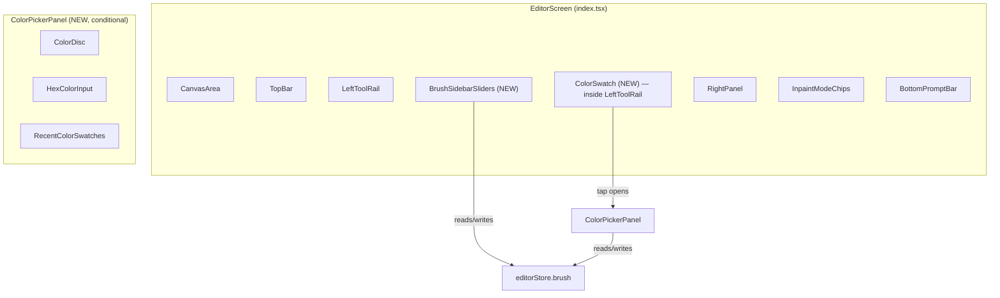
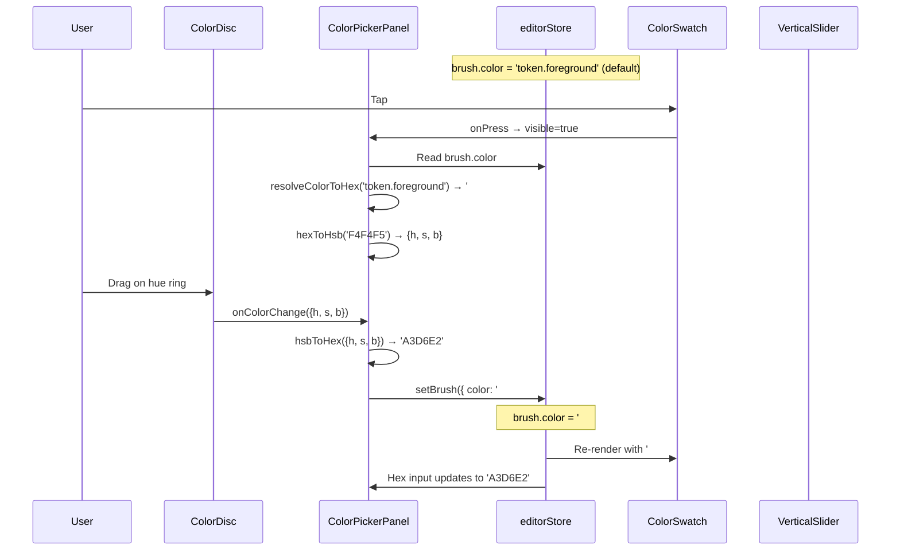

# brush-settings-ui — Design

> **Companion to:** `requirements.md`. **Type:** UI FEATURE — new components in `apps/mobile/` only; no new library code.
> **References:** `brush-system`, `editor-canvas-integration`, `screens-implementation`, `inspirations.md` §Procreate.

## 1. Overview

This design adds three Procreate-inspired brush setting controls to the Editor screen:

1. **Sidebar sliders** — two vertical sliders (size + opacity) on the left edge, adjacent to the LeftToolRail
2. **Color swatch** — a circular indicator at the top of the LeftToolRail that shows the active brush color
3. **Color picker panel** — a floating, draggable panel with an HSB color disc, hex input, and recent color swatches

All components read from and write to `editorStore.brush` via `useEditorStore`. The `color` field in `BrushSlice` transitions from its default opaque token (`'token.foreground'`) to resolved hex strings (`'#RRGGBB'`) the moment the user interacts with any color control. This is a one-way transition per session — once a hex value is set, the token is not restored.

No new code in `libs/`. All files land in `apps/mobile/src/screens/Editor/` (components) and `apps/mobile/src/screens/Editor/brush-settings/` (sub-components). Testing is deferred per `testing.md`.

## 2. Architecture

### 2.1 Component tree placement

The new components mount as siblings of the existing floating UI clusters in `EditorScreen`:



### 2.2 File layout

```
apps/mobile/src/screens/Editor/
├── index.tsx                          # Updated: mounts BrushSidebarSliders + ColorPickerPanel
├── LeftToolRail.tsx                   # Updated: mounts ColorSwatch at top
├── brush-settings/
│   ├── BrushSidebarSliders.tsx        # Vertical size + opacity sliders
│   ├── VerticalSlider.tsx             # Reusable vertical slider (Reanimated + GestureHandler)
│   ├── ColorSwatch.tsx                # Circular color indicator
│   ├── ColorPickerPanel.tsx           # Floating draggable panel shell
│   ├── ColorDisc.tsx                  # HSB wheel (Skia Canvas)
│   ├── HexColorInput.tsx              # Hex text input with validation
│   ├── RecentColorSwatches.tsx        # Row of recent color circles
│   ├── color-utils.ts                 # HSB ↔ hex conversion, validation
│   └── use-recent-colors.ts           # Hook managing recent colors list
```

### 2.3 Resolved decisions

| ID | Decision | Rationale |
|---|---|---|
| D1 | **Color disc rendered with `@shopify/react-native-skia`** | Already a project dependency (`canvas-skia`). Skia's `SweepGradient` draws the hue ring in one call; the inner SV triangle/square is a shader. No additional dependency needed. |
| D2 | **Vertical sliders are custom components** (not the existing horizontal `Slider` from `@diffusecraft/ui`) | The existing `Slider` is horizontal-only and uses `@rn-primitives/slider` which doesn't support vertical orientation. A custom `VerticalSlider` built on `react-native-gesture-handler` + `react-native-reanimated` is simpler than rotating the existing component. |
| D3 | **Color picker panel uses `PanGesture` for dragging** (not `Popover` from `@diffusecraft/ui`) | The `Popover` component is anchored to a trigger and not freely draggable. A custom floating `View` with `Gesture.Pan()` for repositioning matches Procreate's behavior. |
| D4 | **Recent colors stored in React state** (not AsyncStorage) | Recent colors are session-scoped per the requirements (no persistence across app restarts specified). A `useState` + custom hook is sufficient. If persistence is needed later, the hook can be upgraded to AsyncStorage without changing the component API. |
| D5 | **`color` field transitions from token to hex on first interaction** | The `BrushSlice.color` defaults to `'token.foreground'`. When the user first interacts with any color control, the token is resolved to its hex value (`tokens.colors.text.primary` = `'#F4F4F5'`) and written back as a hex string. All subsequent reads/writes use hex. This avoids a dual-mode color system. |
| D6 | **Sidebar sliders positioned to the right of the LeftToolRail** | The LeftToolRail is `left-3` with `w-14` (56pt). The sidebar sliders sit at `left-[76px]` (56 + 12 gap + 8 padding), keeping them visually grouped but not overlapping the rail. |
| D7 | **Color disc uses SV-square (not SV-triangle)** | A square inscribed in the hue ring is easier to implement, easier to touch-target on tablet, and matches Procreate's "Classic" color picker mode. The triangle variant is post-v1. |

## 3. Components and Interfaces

### 3.1 VerticalSlider

A reusable vertical slider built on `react-native-gesture-handler` + `react-native-reanimated`.

```typescript
interface VerticalSliderProps {
  /** Current value (controlled). */
  value: number;
  /** Callback when value changes during drag. */
  onValueChange: (value: number) => void;
  /** Minimum value. */
  min: number;
  /** Maximum value. */
  max: number;
  /** Step size (0 = continuous). */
  step?: number;
  /** Height of the slider track in points. */
  trackHeight?: number;
  /** Render function for the preview indicator near the thumb. */
  renderPreview?: (value: number) => React.ReactNode;
  /** Accessibility label. */
  accessibilityLabel: string;
  /** Accessibility step for VoiceOver increment/decrement. */
  accessibilityStep?: number;
  /** Format function for the value label displayed near the thumb. */
  formatLabel?: (value: number) => string;
}
```

Implementation notes:
- `Gesture.Pan()` on the vertical axis. Dragging up increases value, dragging down decreases.
- The track is a vertical `View` with a filled range indicator.
- The thumb is an `Animated.View` positioned via `translateY` on the UI thread (Reanimated worklet).
- `runOnJS(onValueChange)` fires on each gesture update for real-time store sync.
- The value label appears as a floating `Text` adjacent to the thumb, visible only during drag (fades in/out via Reanimated opacity).
- Minimum touch target: 44pt width (the entire slider column is tappable).
- `accessibilityRole="adjustable"` with `accessibilityValue={{ min, max, now: value }}`.
- VoiceOver increment/decrement uses `accessibilityStep` (defaults to `step` or `(max - min) / 20`).

### 3.2 BrushSidebarSliders

Container that renders two `VerticalSlider` instances stacked vertically.

```typescript
interface BrushSidebarSlidersProps {
  /** Optional className for the outer container. */
  className?: string;
}
```

Behavior:
- Reads `brush.size` and `brush.opacity` from `useEditorStore`.
- Writes via `setBrush({ size })` and `setBrush({ opacity })`.
- Size slider: `min=1`, `max=512`, `step=1`, label shows integer pixels (e.g., "24 px").
- Opacity slider: `min=0.01`, `max=1.0`, `step=0.01`, label shows percentage (e.g., "85%").
- Size slider `renderPreview`: a circle whose diameter scales proportionally to the current size (capped at ~40pt for display).
- Opacity slider `renderPreview`: a circle with fill opacity matching the current value.
- Positioned absolutely: `left-[76px]`, vertically centered in the editor, with a gap between the two sliders.

### 3.3 ColorSwatch

A circular indicator showing the active brush color. Mounted inside `LeftToolRail` above the brush preset buttons.

```typescript
interface ColorSwatchProps {
  /** Callback when the swatch is tapped. */
  onPress: () => void;
}
```

Behavior:
- Reads `brush.color` from `useEditorStore`.
- Resolves the color to a display hex value:
  - If `color` starts with `'token.'`, resolves via the token map (e.g., `'token.foreground'` → `tokens.colors.text.primary`).
  - Otherwise, uses the value directly as a hex string.
- Renders a 36pt diameter circle filled with the resolved color, with a 2pt `border-strong` ring.
- `accessibilityLabel`: `"Brush color: #RRGGBB"` (or color name if available).
- `accessibilityRole="button"`.
- Minimum touch target: 44×44pt (padding around the 36pt circle).

### 3.4 ColorPickerPanel

A floating, draggable panel containing the color disc, hex input, and recent swatches.

```typescript
interface ColorPickerPanelProps {
  /** Whether the panel is visible. */
  visible: boolean;
  /** Callback to close the panel. */
  onClose: () => void;
}
```

Layout (top to bottom):
1. **Drag handle bar** — a small pill-shaped indicator at the top for drag affordance
2. **ColorDisc** — the HSB wheel (see §3.5)
3. **HexColorInput** — text input for hex codes (see §3.6)
4. **RecentColorSwatches** — row of recent colors (see §3.7)

Behavior:
- Renders as an absolute-positioned `View` with `bg-elevated`, `rounded-xl`, shadow, and `z-50`.
- Initial position: centered horizontally, offset from the top by ~120pt (below the TopBar).
- Draggable via `Gesture.Pan()` on the entire panel. Position stored in `useSharedValue` for smooth Reanimated-driven movement.
- Tap-outside-to-dismiss: an `Overlay` `Pressable` behind the panel catches taps and calls `onClose`.
- Dismissible via accessibility escape gesture (two-finger Z-scrub on iOS) — handled by wrapping content in a component that responds to the `accessibilityEscape` callback.
- Panel size: ~300pt wide × ~420pt tall (fits comfortably on iPad in landscape).

### 3.5 ColorDisc

An HSB color wheel rendered with `@shopify/react-native-skia`.

```typescript
interface ColorDiscProps {
  /** Current color in HSB. */
  hsb: { h: number; s: number; b: number };
  /** Callback when the user selects a color. */
  onColorChange: (hsb: { h: number; s: number; b: number }) => void;
}
```

Structure:
- **Outer hue ring**: A `Circle` with a `SweepGradient` cycling through the full hue spectrum (0°–360°). Ring width: ~24pt. A small circular indicator on the ring shows the current hue angle.
- **Inner SV square**: A `Rect` inscribed within the hue ring. Filled with two overlapping gradients:
  - Horizontal: white (left) → full-saturation hue color (right) — saturation axis.
  - Vertical: transparent (top) → black (bottom) — brightness axis.
  - A small crosshair indicator shows the current S/B position.

Gesture handling:
- `Gesture.Pan()` on the Skia `Canvas`. On each update:
  - Compute distance from center. If within the ring band → update hue based on angle.
  - If within the inner square → update saturation (x-axis) and brightness (y-axis).
- All position → color math runs in Reanimated worklets for zero-lag updates.
- `runOnJS(onColorChange)` fires on each gesture update.

Rendering approach:
- The Skia `Canvas` is ~260×260pt.
- The hue ring and SV square are drawn as Skia primitives (no bitmap textures).
- The indicators (hue dot, SV crosshair) are `Circle` / `Line` primitives updated via shared values.

### 3.6 HexColorInput

A text input for entering hex color codes.

```typescript
interface HexColorInputProps {
  /** Current hex value (without #). */
  hex: string;
  /** Callback when a valid hex is entered. */
  onHexChange: (hex: string) => void;
  /** Whether the input is in an error state. */
  error?: boolean;
}
```

Behavior:
- Uses the `Input` component from `@diffusecraft/ui`.
- Prefixed with a non-editable `#` character (rendered as a `Text` sibling).
- Validates on blur and on Enter:
  - Valid: 6 hex characters (`/^[0-9A-Fa-f]{6}$/`). Calls `onHexChange`.
  - Invalid: shows a red border (`border-danger-default`), retains previous color.
- When the color changes externally (disc drag, eyedropper, swatch tap), the input updates to reflect the new hex value.
- `maxLength={6}`, `autoCapitalize="characters"`, `keyboardType="ascii-capable"`.

### 3.7 RecentColorSwatches

A horizontal row of recently used color circles.

```typescript
interface RecentColorSwatchesProps {
  /** List of recent hex colors, most-recent-first. */
  colors: readonly string[];
  /** Callback when a swatch is tapped. */
  onSelect: (hex: string) => void;
}
```

Behavior:
- Renders up to 10 circular swatches (24pt diameter, 4pt gap).
- Each swatch is a `Pressable` with `accessibilityLabel="Recent color #RRGGBB"`.
- Tapping a swatch calls `onSelect(hex)`.
- The active color (matching `brush.color`) gets a 2pt accent ring.

### 3.8 color-utils.ts

Pure utility functions for color conversion and validation.

```typescript
/** HSB color representation. h: 0–360, s: 0–1, b: 0–1. */
interface HSBColor {
  h: number;
  s: number;
  b: number;
}

/** Convert HSB to hex string (without #). */
function hsbToHex(hsb: HSBColor): string;

/** Convert hex string (without #) to HSB. */
function hexToHsb(hex: string): HSBColor;

/** Validate a hex string (6 characters, valid hex digits). */
function isValidHex(hex: string): boolean;

/** Resolve a brush color value to a display hex string. */
function resolveColorToHex(color: string): string;

/** Clamp a number to [min, max]. */
function clampValue(value: number, min: number, max: number): number;
```

`resolveColorToHex` handles the token → hex transition:
- If `color` starts with `'token.'`, looks up the token name in a map derived from `tokens.colors` (e.g., `'token.foreground'` → `'#F4F4F5'`).
- If `color` starts with `'#'`, returns it as-is.
- Otherwise, returns a fallback (`'#F4F4F5'`).

### 3.9 use-recent-colors.ts

A custom hook managing the recent colors list.

```typescript
function useRecentColors(): {
  /** Recent colors, most-recent-first. Max 10. */
  colors: readonly string[];
  /** Push a color to the front of the list. Deduplicates and evicts oldest if > 10. */
  pushColor: (hex: string) => void;
};
```

Behavior:
- Maintains a `useState<string[]>` internally.
- `pushColor(hex)`:
  1. Remove `hex` from the list if already present (dedup).
  2. Prepend `hex` to the front.
  3. If length > 10, drop the last entry.
- Case-insensitive comparison (normalizes to uppercase).

## 4. Data Models

### 4.1 Color representation flow



### 4.2 Store interaction

All components interact with the same `editorStore.brush` slice:

| Component | Reads | Writes |
|---|---|---|
| `BrushSidebarSliders` | `brush.size`, `brush.opacity` | `setBrush({ size })`, `setBrush({ opacity })` |
| `ColorSwatch` | `brush.color` | — (display only) |
| `ColorPickerPanel` | `brush.color` | `setBrush({ color: '#RRGGBB' })` |
| `LeftToolRail` (existing) | `activeTool` | `setActiveTool`, `setBrush` (preset switch) |

### 4.3 Eyedropper integration

The eyedropper gesture in `useGestureCompositor.ts` already has a TODO for color sampling. When implemented, it will call `setBrush({ color: '#RRGGBB' })` with the sampled hex value. Because all color UI components subscribe to `brush.color` via `useEditorStore`, they will automatically reflect the eyedropper-picked color — no additional wiring needed.

The `ColorPickerPanel` (if open) will see the store change and update the disc position + hex input. The `ColorSwatch` will update its fill color. The `useRecentColors` hook does not auto-push eyedropper colors (the user hasn't "selected" a color via the picker); the previous color is pushed to recents only when the user interacts with the `ColorDisc` directly.

## 5. Correctness Properties

*A property is a characteristic or behavior that should hold true across all valid executions of a system — essentially, a formal statement about what the system should do. Properties serve as the bridge between human-readable specifications and machine-verifiable correctness guarantees.*

> **Note:** Testing is deferred per `testing.md`. These properties document the intended invariants for when testing resumes.

### Property 1: Slider value clamping

*For any* numeric input passed through the slider value pipeline, the resulting value written to `BrushSlice` SHALL be within the configured `[min, max]` range — `[1, 512]` for size and `[0.01, 1.0]` for opacity.

**Validates: Requirements 1.4, 2.4**

### Property 2: HSB ↔ hex color conversion round trip

*For any* valid HSB color `{h, s, b}` where `h ∈ [0, 360)`, `s ∈ [0, 1]`, `b ∈ [0, 1]`, converting to hex via `hsbToHex` and back via `hexToHsb` SHALL produce an HSB value within ±1 of the original on each component (accounting for 8-bit quantization).

**Validates: Requirements 4.5, 6.2**

### Property 3: Recent colors list invariants

*For any* sequence of `pushColor` operations on the recent colors list, the list SHALL: (a) never exceed 10 entries, (b) be ordered most-recent-first, (c) contain no duplicates (case-insensitive), and (d) when a new color is pushed, the previously active color SHALL appear at position 0 of the list.

**Validates: Requirements 5.2, 5.4, 5.5**

### Property 4: Invalid hex rejection

*For any* string that does not match the pattern `/^[0-9A-Fa-f]{6}$/`, entering it in the hex input SHALL leave the `brush.color` value in `BrushSlice` unchanged.

**Validates: Requirements 6.3**

## 6. Error Handling

| Scenario | Handling |
|---|---|
| Invalid hex input | Red border on input field; previous color retained; no store write. Error clears on next valid input or on blur if the field reverts to the current color. |
| Token resolution failure | If `brush.color` contains an unrecognized token, `resolveColorToHex` returns the fallback `'#F4F4F5'` (text.primary). Logged as a warning via the RN logger. |
| Gesture conflict with canvas | The sidebar sliders and color picker panel use `Gesture.Pan()` which could conflict with canvas gestures. Resolved by: (a) sliders are outside the canvas touch area (absolute-positioned left of canvas), (b) the color picker panel's overlay captures all touches, preventing canvas interaction while open. |
| Slider value out of range | `clampValue` is called before every `setBrush` write. Even if a gesture produces an out-of-range value (e.g., due to momentum), the clamped value is what reaches the store. |
| Color disc touch outside ring/square | Touches that land in the gap between the hue ring and the SV square are ignored (no color change). The gesture handler checks distance-from-center to determine which zone the touch is in. |

## 7. Testing Strategy

> **Testing is deferred** per `.kiro/steering/testing.md`. This section documents the intended strategy for when testing resumes at end of v1.

### Unit tests (Vitest)

Target: `color-utils.ts` and `use-recent-colors.ts` — pure functions and hook logic.

- `hsbToHex` / `hexToHsb` round-trip correctness (Property 2)
- `isValidHex` accepts valid hex, rejects invalid
- `clampValue` enforces bounds (Property 1)
- `resolveColorToHex` handles tokens, hex strings, and unknown values
- `useRecentColors.pushColor` maintains list invariants (Property 3)

### Property tests (fast-check)

When testing resumes, the following properties should be implemented using `fast-check`:

- **Property 1** (slider clamping): Generate random floats, verify `clampValue` output is in range. Min 100 iterations.
  - Tag: `Feature: brush-settings-ui, Property 1: Slider value clamping`
- **Property 2** (HSB ↔ hex round trip): Generate random HSB triples, verify round-trip within tolerance. Min 100 iterations.
  - Tag: `Feature: brush-settings-ui, Property 2: HSB ↔ hex color conversion round trip`
- **Property 3** (recent colors list): Generate random sequences of hex strings, apply `pushColor` in order, verify invariants. Min 100 iterations.
  - Tag: `Feature: brush-settings-ui, Property 3: Recent colors list invariants`
- **Property 4** (invalid hex rejection): Generate random non-hex strings, verify `isValidHex` returns false. Min 100 iterations.
  - Tag: `Feature: brush-settings-ui, Property 4: Invalid hex rejection`

### Component tests (RN Testing Library)

- `ColorSwatch` renders correct fill color from store
- `BrushSidebarSliders` displays correct labels
- `HexColorInput` shows error state on invalid input
- `ColorPickerPanel` opens/closes on swatch tap / outside tap

### Manual verification (current phase)

During the deferred-testing phase, verification is:
1. TypeScript compiles (`nx typecheck mobile`)
2. Visual inspection on iPad simulator — sliders respond to drag, color disc updates in real time, hex input validates
3. VoiceOver audit — sliders announce as adjustable, swatch announces color, panel dismisses on escape gesture
