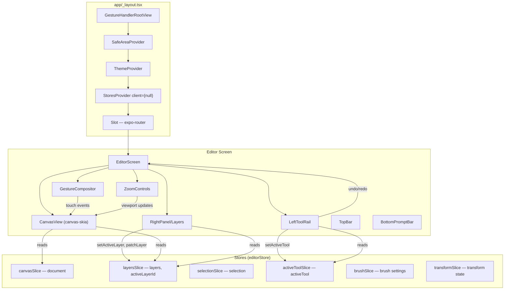
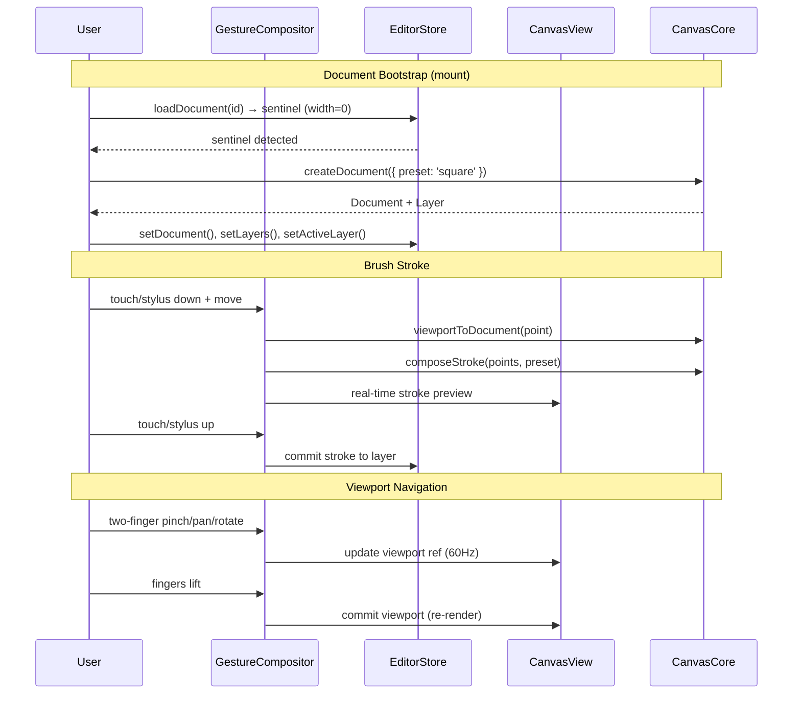

# editor-canvas-integration — Design

> **Companion to:** `requirements.md`. **Type:** INTEGRATION — wires existing implementations; no new library code.
> **References:** `canvas-fundamentals`, `client-state-architecture`, `brush-system`, `selection-tools`, `transform-tools`, `mask-system`, `undo-redo-system`, `screens-implementation`.

## 1. Resolved decisions

| ID | Decision |
|---|---|
| Q1 | **Client-side bootstrap document.** `createDocument()` from `canvas-core` in the Editor mount effect. No server dependency. |
| Q2 | **Viewport in component-local state** (`useRef` for gesture-frequency updates + `useState` for committed value). Not in Zustand — too high frequency. |
| Q3 | **StoresProvider at app root** (`app/_layout.tsx`). Future-proof for other screens needing store access. |
| Q4 | **Gesture ownership until all fingers lift** (Procreate behavior). Once recognized, a gesture owns the touch sequence. |
| Q5 | **Local-only strokes in this phase.** No server. Optimistic when `client-sdk` lands later. |

## 2. Overview

This design describes how to wire the existing, tested library implementations into the `apps/mobile` Editor screen. The work is entirely in `apps/mobile/` — no new code in `libs/`.

The integration has six concerns:

1. **Provider mounting** — `StoresProvider` at the app root
2. **Document bootstrap** — create an in-memory document on Editor mount
3. **Canvas rendering** — replace `CanvasPlaceholder` with `<CanvasView />`
4. **Gesture composition** — route touch/stylus events to the correct tool
5. **Panel wiring** — connect Layer panel and Tool rail to `editorStore`
6. **Viewport controls** — zoom/pan/rotate via gestures and buttons



## 3. Architecture

### 3.1 Component tree (post-integration)

```
app/_layout.tsx
├── GestureHandlerRootView
│   └── SafeAreaProvider
│       └── ThemeProvider
│           └── StoresProvider client={null}     ← NEW (FR-5)
│               └── Slot (expo-router)
│                   └── editor/[documentId].tsx
│                       └── EditorScreen
│                           ├── CanvasArea                ← NEW wrapper
│                           │   ├── GestureDetector       ← NEW (FR-34/35)
│                           │   │   └── CanvasView        ← REPLACES CanvasPlaceholder (FR-1)
│                           │   └── ZoomControls          ← EXTRACTED from CanvasPlaceholder
│                           ├── TopBar
│                           ├── LeftToolRail              ← REWIRED to editorStore (FR-36)
│                           ├── RightPanel
│                           │   └── Layers                ← REWIRED to editorStore (FR-8..14)
│                           └── BottomPromptBar
```

### 3.2 New files in `apps/mobile/`

| File | Purpose |
|---|---|
| `src/screens/Editor/CanvasArea.tsx` | Wraps `<CanvasView />` + gesture compositor + zoom controls. Owns viewport state (Q2). |
| `src/screens/Editor/useDocumentBootstrap.ts` | Hook: calls `loadDocument`, detects sentinel, creates bootstrap doc (FR-43/44/45). |
| `src/screens/Editor/useGestureCompositor.ts` | Hook: builds the composed `Gesture.Exclusive` tree (FR-34/35). Returns the gesture object for `<GestureDetector>`. |
| `src/screens/Editor/useViewport.ts` | Hook: manages viewport ref + committed state. Exposes `zoomIn`, `zoomOut`, `resetZoom`, `fitToView`, and gesture update callbacks. |
| `src/screens/Editor/ZoomControls.tsx` | Extracted from `CanvasPlaceholder.tsx`. Wired to `useViewport` callbacks. |
| `src/screens/Editor/useToolGestures.ts` | Hook: returns per-tool gesture handlers (brush stroke, selection draw, transform drag, mask paint, eyedropper). |

### 3.3 Modified files in `apps/mobile/`

| File | Change |
|---|---|
| `app/_layout.tsx` | Wrap `<Slot />` with `<StoresProvider client={null}>` |
| `src/screens/Editor/index.tsx` | Replace `<CanvasPlaceholder>` with `<CanvasArea>`. Add `useDocumentBootstrap`. Rewire `LeftToolRail` to use `editorStore.setActiveTool`. |
| `src/screens/Editor/LeftToolRail.tsx` | Read `activeTool` from `useEditorStore` instead of prop. Map tool rail IDs (`brush-pen`, `brush-pencil`, etc.) to `editorStore` tool + brush preset. |
| `src/screens/Editor/RightPanel/Layers.tsx` | Replace `MOCK_LAYERS` with `useEditorStore((s) => s.layers)`. Wire callbacks to store actions. |
| `src/screens/Editor/useEditorState.ts` | Remove `activeTool` (moved to store). Keep workspace, rightPanelTab, inpaintMode as local state. |

## 4. Components and Interfaces

### 4.1 StoresProvider mounting (FR-5, FR-6, FR-7)

`app/_layout.tsx` already calls `registerUndoToastAdapter`. The only change is wrapping `<Slot />` with `<StoresProvider>`:

```typescript
// app/_layout.tsx — addition
import { StoresProvider } from '@diffusecraft/core';

// Inside RootLayout, wrap Slot:
<StoresProvider client={null}>
  <Slot />
  <PortalHost />
  <ToastProvider />
  <StatusBar style="light" />
</StoresProvider>
```

`client={null}` means all store actions that require a client degrade to no-ops or local-only behavior (FR-6). The `useUndoRedo` hook already handles `null` client defensively.

### 4.2 Document bootstrap (FR-2, FR-43, FR-44, FR-45)

```typescript
// src/screens/Editor/useDocumentBootstrap.ts
import { useEffect, useState } from 'react';
import {
  createDocument,
  addLayer,
  type Document,
} from '@diffusecraft/canvas-core';
import { useEditorStore } from '@diffusecraft/core';

export function useDocumentBootstrap(documentId: string) {
  const [doc, setDoc] = useState<Document | null>(null);
  const setDocument = useEditorStore((s) => s.setDocument);
  const setLayers = useEditorStore((s) => s.setLayers);
  const setActiveLayer = useEditorStore((s) => s.setActiveLayer);
  const loadDocument = useEditorStore((s) => s.loadDocument);

  useEffect(() => {
    let cancelled = false;

    async function boot() {
      // Attempt server load (returns sentinel when client is null)
      await loadDocument(documentId);

      if (cancelled) return;

      // Detect sentinel: width=0 means no server connection
      const storeDoc = useEditorStore.getState?.() // not available — read from effect
      // Instead: create bootstrap doc unconditionally when client is null.
      // The loadDocument with null client sets width=0.

      const bootstrapDoc = createDocument({
        preset: 'square',
        name: 'Untitled',
      });
      const { doc: withLayer, layer } = addLayer(bootstrapDoc, {
        kind: 'paint',
        name: 'Layer 1',
      });

      if (cancelled) return;

      setDoc(withLayer);
      setDocument({
        id: withLayer.id,
        width: withLayer.width,
        height: withLayer.height,
        last_applied_result_uri: null,
      });
      setLayers(withLayer.layers.map((l) => ({
        id: l.id,
        name: l.name,
        kind: l.kind,
        visible: l.visible,
        opacity: l.opacity,
        locked: l.locked,
        blend_mode: l.blend_mode,
        position: l.position,
      })));
      setActiveLayer(layer.id);
    }

    void boot();
    return () => { cancelled = true; };
  }, [documentId]);

  return doc;
}
```

The hook returns the full `Document` object for `<CanvasView />`. The store gets the metadata (layer list, active layer ID, document dimensions). This separation respects NFR-6: image bytes never enter Zustand.

### 4.3 CanvasArea — canvas + gestures + zoom (FR-1, FR-4)

```typescript
// src/screens/Editor/CanvasArea.tsx
import { CanvasView } from '@diffusecraft/canvas-skia';
import { GestureDetector } from 'react-native-gesture-handler';
import { View } from 'react-native';
import type { Document } from '@diffusecraft/canvas-core';

import { useViewport } from './useViewport';
import { useGestureCompositor } from './useGestureCompositor';
import { ZoomControls } from './ZoomControls';

interface CanvasAreaProps {
  document: Document | null;
}

export function CanvasArea({ document }: CanvasAreaProps) {
  const viewport = useViewport(document);
  const gesture = useGestureCompositor(viewport);

  // Stub loadBytes — returns empty bytes. Full blob resolution
  // requires client-sdk wiring from document-management (FR-3).
  const loadBytes = useCallback(
    async (_blobId: string) => new Uint8Array(0),
    [],
  );

  return (
    <View style={{ flex: 1 }}>
      <GestureDetector gesture={gesture}>
        <CanvasView
          document={document}
          viewport={viewport.committed}
          loadBytes={loadBytes}
          style={{ flex: 1 }}
          onAdapterReady={viewport.setAdapter}
        />
      </GestureDetector>
      <ZoomControls
        zoom={viewport.committed.zoom}
        onZoomIn={viewport.zoomIn}
        onZoomOut={viewport.zoomOut}
        onReset={viewport.resetZoom}
        onFitToView={viewport.fitToView}
      />
    </View>
  );
}
```

### 4.4 Viewport management (FR-19..21, FR-39..42)

Viewport state lives in a `useRef` for gesture-frequency updates and a `useState` for the committed value that triggers re-renders (Q2).

```typescript
// src/screens/Editor/useViewport.ts
import { useCallback, useRef, useState } from 'react';
import {
  identityViewport,
  zoomBy,
  panBy,
  rotateBy,
  type Viewport,
  type Document,
} from '@diffusecraft/canvas-core';
import type { SkiaRenderAdapter } from '@diffusecraft/canvas-skia';

const ZOOM_STEP = 1.25;

export function useViewport(document: Document | null) {
  const ref = useRef<Viewport>(identityViewport());
  const [committed, setCommitted] = useState<Viewport>(identityViewport());
  const adapterRef = useRef<SkiaRenderAdapter | null>(null);

  // Called at gesture frequency (60Hz) — updates ref only, no re-render.
  const updateDuringGesture = useCallback((updater: (v: Viewport) => Viewport) => {
    ref.current = updater(ref.current);
    // Direct Skia draw via adapter for smooth gesture rendering
    // without React re-render overhead.
  }, []);

  // Called on gesture end — commits to state, triggers re-render.
  const commit = useCallback(() => {
    setCommitted({ ...ref.current });
  }, []);

  const zoomIn = useCallback(() => {
    ref.current = zoomBy(ref.current, ZOOM_STEP);
    commit();
  }, [commit]);

  const zoomOut = useCallback(() => {
    ref.current = zoomBy(ref.current, 1 / ZOOM_STEP);
    commit();
  }, [commit]);

  const resetZoom = useCallback(() => {
    ref.current = identityViewport();
    commit();
  }, [commit]);

  const fitToView = useCallback(() => {
    if (!document) return;
    // Compute zoom to fit document in available area with 32px padding.
    // Actual available area comes from CanvasArea layout measurement.
    ref.current = identityViewport(); // simplified — real impl measures container
    commit();
  }, [document, commit]);

  const setAdapter = useCallback((adapter: SkiaRenderAdapter) => {
    adapterRef.current = adapter;
  }, []);

  return {
    ref,
    committed,
    updateDuringGesture,
    commit,
    zoomIn,
    zoomOut,
    resetZoom,
    fitToView,
    setAdapter,
  };
}
```

### 4.5 Gesture compositor (FR-34, FR-35)

The gesture compositor uses `react-native-gesture-handler`'s declarative API to build a precedence hierarchy matching `canvas-fundamentals` FR-29:

1. **Tool gestures** (painting, selection, transform) — highest priority
2. **Navigation gestures** (pinch zoom, two-finger pan, two-finger rotate)
3. **Undo/redo taps** (two-finger tap, three-finger tap) — lowest priority

```typescript
// src/screens/Editor/useGestureCompositor.ts
import { useMemo } from 'react';
import { Gesture } from 'react-native-gesture-handler';
import { useEditorStore, useUndoRedo } from '@diffusecraft/core';
import { useToolGestures } from './useToolGestures';
import type { useViewport } from './useViewport';

export function useGestureCompositor(
  viewport: ReturnType<typeof useViewport>,
) {
  const activeTool = useEditorStore((s) => s.activeTool);
  const { undo, redo } = useUndoRedo();
  const toolGestures = useToolGestures(viewport);

  return useMemo(() => {
    // --- Navigation gestures (two-finger) ---
    const pinchZoom = Gesture.Pinch()
      .onUpdate((e) => {
        viewport.updateDuringGesture((v) =>
          zoomBy(v, e.scale / (e.scale - e.velocity + 1)) // simplified
        );
      })
      .onEnd(() => viewport.commit());

    const twoPan = Gesture.Pan()
      .minPointers(2)
      .onUpdate((e) => {
        viewport.updateDuringGesture((v) =>
          panBy(v, e.changeX, e.changeY)
        );
      })
      .onEnd(() => viewport.commit());

    const twoRotate = Gesture.Rotation()
      .onUpdate((e) => {
        viewport.updateDuringGesture((v) =>
          rotateBy(v, (e.rotation * 180) / Math.PI)
        );
      })
      .onEnd(() => viewport.commit());

    // Navigation = simultaneous pinch + pan + rotate (standard multi-touch)
    const navigation = Gesture.Simultaneous(pinchZoom, twoPan, twoRotate);

    // --- Undo/redo taps ---
    const undoTap = Gesture.Tap()
      .numberOfPointers(2)
      .maxDuration(300)
      .onEnd(() => void undo());

    const redoTap = Gesture.Tap()
      .numberOfPointers(3)
      .maxDuration(300)
      .onEnd(() => void redo());

    const undoRedoGestures = Gesture.Race(undoTap, redoTap);

    // --- Long-press eyedropper (FR-48) ---
    const eyedropperLongPress = Gesture.LongPress()
      .minDuration(500)
      .onEnd((e) => {
        // Sample color at tap point via adapter.hitTest
        // Update editorStore brush.color
      });

    // --- Tool gesture (single-finger, active tool dependent) ---
    const toolGesture = toolGestures.forTool(activeTool);

    // Precedence: tool > navigation > undo/redo > eyedropper
    // Q4: once a gesture is recognized, it owns the touch sequence
    return Gesture.Exclusive(
      toolGesture,
      navigation,
      undoRedoGestures,
      eyedropperLongPress,
    );
  }, [activeTool, viewport, undo, redo, toolGestures]);
}
```

### 4.6 Tool gestures (FR-16, FR-26, FR-22, FR-29)

```typescript
// src/screens/Editor/useToolGestures.ts
import { useMemo, useCallback } from 'react';
import { Gesture, type GestureType } from 'react-native-gesture-handler';
import { useEditorStore } from '@diffusecraft/core';
import {
  viewportToDocument,
  type Viewport,
  type EditorTool,
} from '@diffusecraft/canvas-core';

export function useToolGestures(
  viewport: { ref: React.MutableRefObject<Viewport> },
) {
  const DEFAULT_PRESSURE = 0.5; // finger touch default (FR-17)

  const forTool = useCallback((tool: EditorTool): GestureType => {
    switch (tool) {
      case 'brush':
      case 'eraser': {
        // Single-finger pan captures stroke points
        return Gesture.Pan()
          .minPointers(1)
          .maxPointers(1)
          .onBegin((e) => {
            // Begin stroke: capture first point with pressure
            const docPoint = viewportToDocument(viewport.ref.current, {
              x: e.x, y: e.y,
            });
            // Accumulate stroke points in a ref
          })
          .onUpdate((e) => {
            // Add point to stroke with pressure from stylus or DEFAULT_PRESSURE
            const docPoint = viewportToDocument(viewport.ref.current, {
              x: e.x, y: e.y,
            });
            // Feed to composeStroke for real-time rendering
          })
          .onEnd(() => {
            // Commit stroke to active layer (FR-18)
            // Register with undo system (local-only in this phase)
          });
      }

      case 'lasso':
      case 'rect-select': {
        return Gesture.Pan()
          .minPointers(1)
          .maxPointers(1)
          .onBegin((e) => {
            // Start selection path
          })
          .onUpdate((e) => {
            // Extend selection path / rectangle
          })
          .onEnd(() => {
            // Finalize selection, update editorStore.selectionSlice (FR-27)
          });
      }

      case 'transform': {
        return Gesture.Pan()
          .minPointers(1)
          .maxPointers(1)
          .onBegin((e) => {
            // Hit-test for transform handles
            // Begin transform on active layer (FR-22)
          })
          .onUpdate((e) => {
            // Apply translate with snap targets (FR-23)
          })
          .onEnd(() => {
            // Commit transform
          });
      }

      case 'eyedropper': {
        return Gesture.Tap()
          .onEnd((e) => {
            // Sample color at point (FR-47)
          });
      }

      default: {
        // Pan tool or unknown — pass through to navigation
        return Gesture.Pan().enabled(false);
      }
    }
  }, [viewport]);

  return useMemo(() => ({ forTool }), [forTool]);
}
```

### 4.7 Layer panel wiring (FR-8..14)

The `Layers` component replaces `MOCK_LAYERS` with store reads and wires callbacks to store actions:

```typescript
// Key changes to RightPanel/Layers.tsx

import { useEditorStore } from '@diffusecraft/core';
import { addLayer, removeLayer, reorderLayer } from '@diffusecraft/canvas-core';

export function Layers() {
  // FR-8: read from store instead of MOCK_LAYERS
  const layers = useEditorStore((s) => s.layers);
  const activeLayerId = useEditorStore((s) => s.activeLayerId);
  const setActiveLayer = useEditorStore((s) => s.setActiveLayer);
  const patchLayer = useEditorStore((s) => s.patchLayer);
  const setLayers = useEditorStore((s) => s.setLayers);

  // FR-9: tap to select
  const handleTapLayer = (layerId: string) => setActiveLayer(layerId);

  // FR-10: toggle visibility
  const handleToggleVisible = (layerId: string, visible: boolean) =>
    patchLayer(layerId, { visible });

  // FR-11: adjust opacity
  const handleOpacityChange = (layerId: string, opacity: number) =>
    patchLayer(layerId, { opacity });

  // FR-12: add layer — uses canvas-core addLayer, updates store
  const handleAddLayer = () => {
    // Get current document from store, apply addLayer, update store
  };

  // FR-13 / FR-13a: swipe reveals a Delete button; tap commits the
  // deletion. Swipe alone never mutates. The bottom-most row (FR-13b) is
  // rendered without a Swipeable wrapper, and removeLayerById additionally
  // rejects position-0 removals (defense-in-depth — see FR-13b rationale,
  // grounded in P28 raster-only).
  const handleDeleteLayer = (layerId: string) => {
    // Tapped from inside renderRightActions's onPress — calls
    // removeLayer from canvas-core after closing the swipeable.
  };

  // FR-14: drag to reorder
  const handleReorder = (layerId: string, toPosition: number) => {
    // Apply reorderLayer from canvas-core, update store
  };

  // ... render using store data instead of local state
}
```

### 4.8 Tool rail wiring (FR-15, FR-36, FR-37, FR-38)

The `LeftToolRail` maps its tool IDs to `editorStore` actions:

```typescript
// Key changes to LeftToolRail.tsx

import { useEditorStore } from '@diffusecraft/core';
import { getBrushPreset, type BrushPresetId } from '@diffusecraft/canvas-core';

// Mapping from rail tool IDs to store actions
const TOOL_MAP: Record<string, { tool: EditorTool; preset?: BrushPresetId }> = {
  'brush-pen':     { tool: 'brush',      preset: 'pen' },
  'brush-pencil':  { tool: 'brush',      preset: 'pencil' },
  'brush-marker':  { tool: 'brush',      preset: 'marker' },
  'brush-eraser':  { tool: 'eraser',     preset: 'eraser' },
  'brush-smooth':  { tool: 'brush',      preset: 'smooth' },
  'selection':     { tool: 'lasso' },
  'transform':     { tool: 'transform' },
  'mask':          { tool: 'brush' },     // mask painting uses brush tool on mask layer
  'eyedropper':    { tool: 'eyedropper' },
};

function handleToolChange(railId: string) {
  const mapping = TOOL_MAP[railId];
  if (!mapping) return;

  editorStore.setActiveTool(mapping.tool);

  if (mapping.preset) {
    const preset = getBrushPreset(mapping.preset);
    editorStore.setBrush({
      size: preset.size,
      hardness: preset.hardness,
      opacity: preset.opacity,
      pressureCurve: [...preset.pressureCurve],
    });
  }
}
```

### 4.9 Mask painting wiring (FR-29, FR-30)

When the active layer is a mask layer and the mask tool is selected, brush strokes route to the mask painting pipeline. The gesture handler checks the active layer's `kind`:

- If `kind === 'mask'`: stroke color is interpreted as greyscale alpha. White brush adds to mask, eraser subtracts.
- The `CanvasView` renders the mask preview overlay (red translucent) via the existing `canvas-skia` overlay system.

No new code in `libs/` — the overlay rendering is already implemented in `canvas-skia/src/overlay/`. The integration wires the active layer kind check into the tool gesture handler.

### 4.10 Pressure handling (FR-17)

Apple Pencil pressure events are available through `react-native-gesture-handler`'s `Pan` gesture via the `force` property on touch events. The integration:

1. Reads `e.force` (0.0–1.0) from gesture events when available (stylus)
2. Falls back to `DEFAULT_PRESSURE = 0.5` for finger touches
3. Modulates stamp size/opacity via the active preset's `pressureCurve` using `samplePressureCurve` from `canvas-core`

## 5. Data Models

No new data models are introduced. This spec wires existing models:

| Model | Source | Used by |
|---|---|---|
| `Document` | `@diffusecraft/canvas-core` | `useDocumentBootstrap`, `CanvasArea` |
| `Layer` | `@diffusecraft/canvas-core` | Layer panel, gesture handlers |
| `Viewport` | `@diffusecraft/canvas-core` | `useViewport`, `CanvasView` |
| `BrushPreset` | `@diffusecraft/canvas-core` | Tool rail mapping |
| `EditorState` (6 slices) | `@diffusecraft/core` | All components via hooks |
| `Selection` | `@diffusecraft/canvas-core` | Selection tool gestures |

### Data flow



## 6. Error Handling

Since this is an integration spec with `client={null}` and local-only operations, error scenarios are limited:

| Scenario | Handling |
|---|---|
| `loadDocument` returns sentinel (width=0) | Create bootstrap document locally (FR-43). This is the expected path in this phase. |
| `createDocument` throws (invalid preset) | Should not happen with hardcoded `'square'` preset. If it does, render an error state in the Editor screen. |
| `addLayer` / `removeLayer` on missing layer | `canvas-core` operations return the document unchanged (no-op). UI stays consistent. |
| Gesture handler throws | `react-native-gesture-handler` catches internally. Log the error; gesture becomes a no-op for that touch sequence. |
| `CanvasView` receives null document | Renders an empty Skia surface (handled by `CanvasView` internally). |
| `useUndoRedo` with null client | Both `undo()` and `redo()` are no-ops (already implemented in the hook). Toast adapter still fires if registered. |
| Store hook used outside `StoresProvider` | Throws with a descriptive error message (existing behavior in `hooks.ts`). Prevented by mounting provider at app root. |

## 7. Testing Strategy

**Testing is deferred** per `.kiro/steering/testing.md`. No test files are created in this spec.

**Property-based testing is not applicable** for this spec. This is integration wiring — React component composition, gesture handler plumbing, and store subscriptions. There are no pure functions with input/output behavior being created. The existing library functions (`createDocument`, `addLayer`, `zoomBy`, `panBy`, etc.) are already tested in their respective specs.

**Verification during implementation** uses the approach mandated by `testing.md`:
- TypeScript compiles (`nx typecheck mobile`)
- Manual run on iPad simulator / device
- Visual inspection: canvas renders, gestures respond, layers panel updates, tool switching works
- Each user story from §3 of requirements is manually exercised

**When testing resumes (end of v1):**
- Component tests for `CanvasArea`, `useDocumentBootstrap`, `useGestureCompositor` using React Native Testing Library
- Integration tests verifying store ↔ component data flow
- Maestro E2E tests for the nine user stories
