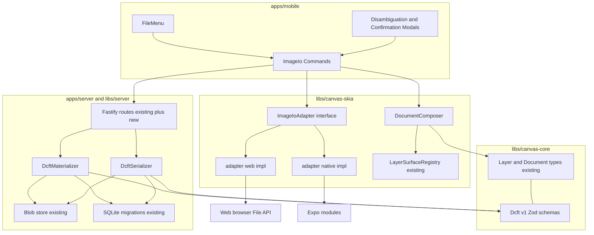
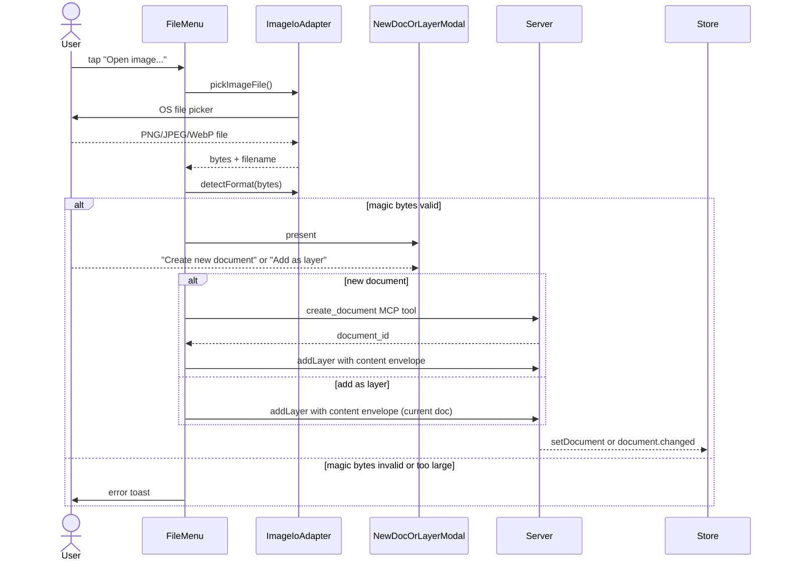
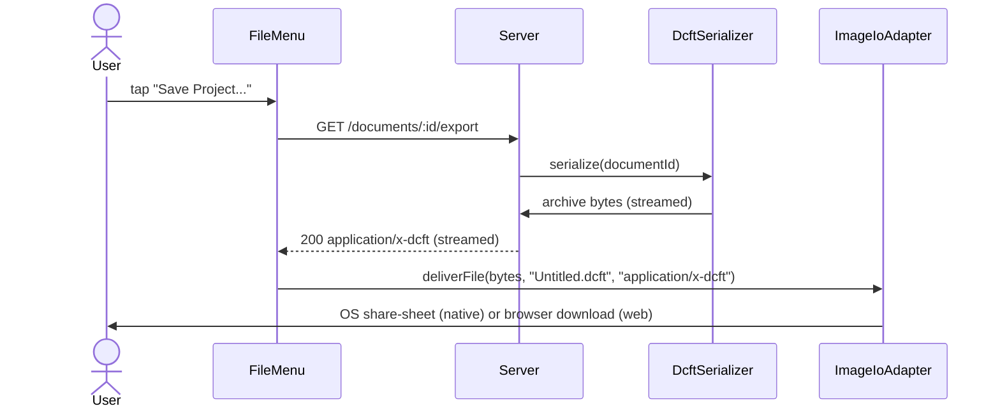
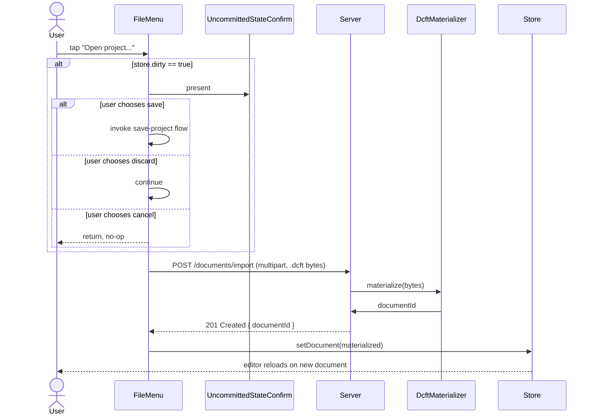
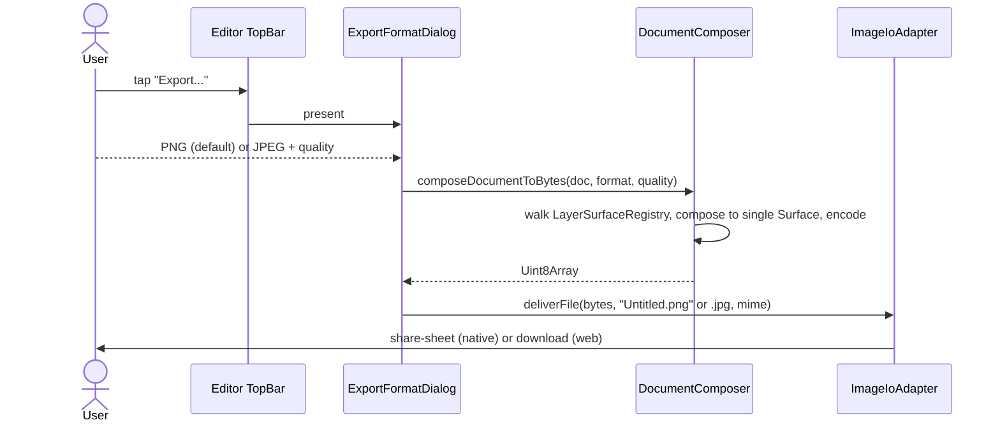

# Design Document: image-io

## Overview

**Purpose**: Add file-system import and export to DiffuseCraft's tablet client on iOS, Android, and web — picker-driven image import (PNG / JPEG / WebP), `.dcft` project file open and save, and flat raster export of the composed document (PNG / JPEG).

**Users**: The AI-native illustrator (per `product.md`) gains the ability to bring reference photos onto the canvas and to ship a finished image out of the app via the OS share-sheet (native) or browser download (web). The same flows are available equivalently across all three target platforms.

**Impact**: Wires new client-side surfaces (file menu, modals, share/download), adds two HTTP endpoints to the server under the existing pairing-token auth boundary, defines the `.dcft v1` portable file format, and adds a client-side multi-layer composite path so raster export does not require server reachability. Drag-drop and clipboard paste (FR-16) remain out of scope and are deferred to a `canvas-fundamentals` follow-up; the design exposes a shared layer-creation seam those paths will reuse when they land.

### Goals

- Pickable image import on native and web with the same observable outcome (Requirements 1, 5).
- Server-mediated `.dcft` open and save with round-trip equivalence (Requirements 2, 3, 3.10).
- Pure client-side raster export that works without server reachability (Requirements 4, 4.10).
- Shared platform-adapter seam (`ImageIoAdapter`) so future picker / sharer integrations slot in without re-plumbing.
- Zero changes to existing `documents` / `layers` / `blobs` DB schema; reuse the existing pairing-token auth boundary.

### Non-Goals

- Drag-drop and clipboard paste import (FR-16) — owned by a separate `canvas-fundamentals` follow-up.
- Per-layer or per-selection export.
- PSD / TIFF / SVG / PDF / GIF / video formats.
- Direct cloud storage provider integrations beyond what the OS picker exposes.
- MCP / agent-driven file I/O — out of scope (post-v1 candidate).
- `.dcft` cross-version compatibility — `.dcft v1` only.
- Color management, P3, ICC profiles.
- Updates to `tech.md` ("Web/PWA excluded" still says so) — drift resolution belongs to a `/kiro-steering` pass.

## Boundary Commitments

### This Spec Owns

- The `ImageIoAdapter` interface plus its `.native.ts` and `.web.ts` implementations.
- Client-side multi-layer composite (`composeDocumentToBytes`) on top of `LayerSurfaceRegistry`.
- Client-side picker, share-sheet, and download orchestration on iOS, Android, and web.
- Modal flow that disambiguates "Create new document" vs. "Add as new layer" after an image pick.
- Format dialog (PNG/JPEG + quality) for raster export.
- Uncommitted-state confirmation prompt before any document replacement.
- A `dirty` bit on the document store, set by document mutations, cleared by successful saves.
- The `.dcft v1` portable file format definition (manifest schema, document description, per-layer raster layout).
- Server-side `.dcft v1` serializer and materializer, plus the two HTTP endpoints that surface them.
- 100 Mpx image-decode and 2 GB `.dcft` size limits, enforced on both client and server.
- File-menu UI affordances on the Documents screen and the Editor TopBar.

### Out of Boundary

- FR-16 drag-drop and clipboard-paste import paths.
- The MCP-tool wrapping of `.dcft` import/export (post-v1; design leaves the server-side serializer/materializer reusable so a future MCP tool can wrap them without refactor).
- Per-layer export, batch export, multi-document export.
- Steering doc updates (`tech.md` Web/PWA exclusion language).
- New layer kinds; the format only handles existing layer kinds (`paint`, `mask`, `control`, `region`).

### Allowed Dependencies

- Existing libraries:
  - `libs/canvas-core` — layer / document / blob types; the `.dcft v1` Zod schemas live here so both client and server can import them.
  - `libs/canvas-skia` — Surface, `encodeToBytes`, `LayerSurfaceRegistry`; the platform adapter and composer live here because they are RN-platform code (`platform:rn` tag).
  - `libs/server` — Fastify, `dcft_*` bearer auth, blob store, db migrations.
  - `libs/core` — Zustand stores (extends `editor` slice with a `dirty` field).
- New external dependencies:
  - `expo-document-picker` — native picker for `.dcft` and image files on Files / scoped storage.
  - `expo-image-picker` — native picker for the photo library (preferred for image-only import on iOS / Android).
  - `expo-sharing` — native share-sheet for delivered files.
  - `expo-file-system` — native temp file path required by `expo-sharing` (which shares URLs, not byte buffers).
  - `expo-media-library` — optional native "Save to Photos" path for raster export.
  - `fflate` — universal, lightweight (~20 KB) ZIP read/write; works on Node and browser without native bindings.
  - `@fastify/multipart` — server-side multipart parser for the `.dcft` upload endpoint.
  - `file-type` — magic-byte detection on both client and server.
- Dependency direction:
  - `apps/mobile` → `libs/canvas-skia` → `libs/canvas-core` (existing).
  - `apps/server` → `libs/server` → `libs/canvas-core` (existing).
  - `libs/canvas-skia` does not import from `libs/server` or `libs/diffusion-client` (Nx tag rules).

### Revalidation Triggers

- Change to the `Layer` shape in `libs/canvas-core/src/layers/types.ts` → re-validate `.dcft v1` round-trip equivalence and bump format version if the field is exposed.
- New layer `kind` value (e.g. `animation`, `vector`) → `.dcft v1` materializer must reject; format must bump.
- Change to pairing-token auth → re-validate `/documents/import` and `/documents/:id/export` route guards.
- canvaskit-wasm version change on web → re-validate `encodeToBytes` JPEG/PNG parity and 25 Mpx composite memory ceiling.
- Removal or rename of the `blobs` table or `content_blob_id` column → both serializer and materializer break.
- Addition of new mandatory document fields → serializer must persist them; materializer must read them; missing fields in old archives must surface a validation error.

## Architecture

### Existing Architecture Analysis

- The codebase already separates pure document logic (`libs/canvas-core`) from rendering (`libs/canvas-skia`); `.dcft v1` schemas land in `canvas-core` because both client and server import them and neither needs Skia for serialization.
- All existing document operations flow through MCP tools (`libs/mcp-tools`); the design adds two REST endpoints to `libs/server`, accepting that file I/O is human-only in v1 (out-of-boundary for MCP). The serializer and materializer are kept transport-agnostic so a future MCP tool can wrap them.
- The Nx module-boundary tags forbid `scope:canvas` from depending on `scope:server` and vice versa; the `.dcft` Zod schemas in `canvas-core` are the only shared seam, and they describe data, not transport.
- The platform-split convention (`stdio.native.ts` in `libs/diffusion-client`) is reused for the picker / sharer adapter.

### Architecture Pattern & Boundary Map



**Key Decisions**:

- **Hybrid transport** (per `research.md` Option C): pure client-side for raster (R4.10), server-mediated for `.dcft` (server already owns document state).
- **Two new HTTP routes** instead of a new MCP tool, because (a) `.dcft` archives can be hundreds of MB and exceed the 256 KB inline-envelope cap, and (b) the existing blob endpoints don't surface multipart upload. Routes inherit the existing `dcft_*` bearer auth.
- **`.dcft v1` schemas in `canvas-core`** so both client and server validate identically with the same Zod source.
- **No new MCP tools in v1** — file I/O is human-only this round; the materializer/serializer stay transport-agnostic so wrapping them later is a 30-line MCP tool.

### Technology Stack

| Layer | Choice / Version | Role in Feature | Notes |
|-------|------------------|-----------------|-------|
| Native client | Expo SDK (per `apps/mobile/package.json`) + new `expo-document-picker`, `expo-image-picker`, `expo-sharing`, `expo-file-system`, `expo-media-library` | OS picker, share-sheet, temp file, optional Save-to-Photos | All first-party Expo modules; align minor versions to current SDK |
| Web client | `react-native-web@0.21.2` + `canvaskit-wasm@0.41.0` (CDN) + browser File API | Picker, drag-drop overlay, `<a download>`, `showSaveFilePicker` (progressive enhancement), `Skia.Surface.makeImageSnapshot` and `encodeToBytes` for composite | RN-Web target landed in commit `66d57b4`; canvaskit-wasm preloaded in `index.web.ts` |
| ZIP container | `fflate` | `.dcft v1` archive read/write on both client (not used in v1; future) and server | Pure-JS, ~20 KB, no native bindings, supports both Node and browser |
| Server transport | Existing Fastify + `@fastify/multipart` | Two new routes: `POST /documents/import`, `GET /documents/:id/export` | Multipart for upload; streamed response for download |
| File detection | `file-type` | Magic-byte sniff on the import path | Avoids trusting OS-reported MIME |
| Validation | Existing Zod (per `tech.md`) | `.dcft v1` manifest + document JSON schemas | Single source of truth, mirrored client-and-server |
| Document store | Existing Zustand (`libs/core/src/stores/editor`) | New `dirty: boolean` slice | Hooked into existing layer mutation paths |

## File Structure Plan

### Directory Structure

```
libs/canvas-core/src/
└── dcft/
    └── types.ts                       # NEW: DcftManifestSchema, DcftDocumentJsonSchema (Zod)

libs/canvas-skia/src/
├── io/
│   ├── adapter.ts                     # NEW: ImageIoAdapter interface and platform-pick re-export
│   ├── adapter.native.ts              # NEW: Expo-backed implementation
│   ├── adapter.web.ts                 # NEW: File API + download implementation
│   ├── composer.ts                    # NEW: composeDocumentToBytes(doc, format, quality)
│   └── limits.ts                      # NEW: 100 Mpx and 2 GB constants, magic-byte helpers

libs/server/src/lib/
├── dcft/
│   ├── archive.ts                     # NEW: fflate read/write wrappers (zip pack, zip unpack)
│   ├── serializer.ts                  # NEW: Document and Layer rows + blobs to .dcft bytes
│   ├── materializer.ts                # NEW: .dcft bytes to new Document and Layer rows + ingested blobs
│   └── limits.ts                      # NEW: shared 2 GB cap, version constant
└── transports/
    └── http.ts                        # MODIFIED: register POST /documents/import, GET /documents/:id/export

libs/core/src/stores/editor/
├── dirty-slice.ts                     # NEW: dirty bit + setDirty / clearDirty actions
└── canvas-slice.ts                    # MODIFIED: hook layer mutations to dirty-slice

apps/mobile/src/
├── commands/image-io/
│   ├── open-image.ts                  # NEW: pick image, modal, dispatch new-doc or add-layer
│   ├── open-project.ts                # NEW: pick .dcft, upload, replace active doc
│   ├── place-image.ts                 # NEW: convenience for "Place image..." (skips modal, always layer)
│   ├── save-project.ts                # NEW: request server emit, deliver via adapter
│   └── export-raster.ts               # NEW: format dialog, composeDocumentToBytes, deliver
└── screens/Editor/
    ├── FileMenu.tsx                   # NEW: dropdown wired to commands
    ├── NewDocOrLayerModal.tsx         # NEW: post-image-pick disambiguation
    ├── ExportFormatDialog.tsx         # NEW: PNG/JPEG + quality slider
    ├── UncommittedStateConfirm.tsx    # NEW: save / discard / cancel before replace
    └── TopBar.tsx                     # MODIFIED: mount FileMenu and wire Share/Save buttons
└── screens/
    └── Documents.tsx                  # MODIFIED: wire onNew TODO + add "Open project..." entry
```

### Modified Files

- `libs/server/src/lib/transports/http.ts` — register two new routes; preserve existing `/mcp` and `/pair` mounts and the `Authorization: Bearer dcft_*` middleware.
- `libs/core/src/stores/editor/canvas-slice.ts` — fire `setDirty()` on every layer mutation funnelled through the slice; fire `clearDirty()` on successful `.dcft` save events.
- `apps/mobile/src/screens/Editor/TopBar.tsx` — replace the unwired `Share2` icon with a `Save Project` / `Export` action and mount the new `FileMenu`.
- `apps/mobile/src/screens/Documents.tsx` — replace the `onNew` TODO at line 71 with a real handler that calls `open-image` (new doc branch) or `open-project`, and add an `Open project…` button alongside.

## System Flows

### Open image flow



### Save project flow



### Open project flow (with uncommitted-state guard)



### Export raster flow



## Requirements Traceability

| Requirement | Summary | Components | Interfaces | Flows |
|-------------|---------|------------|------------|-------|
| 1.1 | Open-image command opens an image-MIME-scoped picker | `FileMenu`, `ImageIoAdapter` | `pickImageFile()` | Open image |
| 1.2 | Modal asks new-doc vs add-layer | `NewDocOrLayerModal` | — | Open image |
| 1.3 | New-doc creates doc sized to image | `commands/image-io/open-image.ts` | `create_document` MCP, `addLayer` MCP | Open image |
| 1.4 | Add-layer appends image layer above selection | `commands/image-io/open-image.ts` | `addLayer` MCP | Open image |
| 1.5, 1.6, 1.7 | Cancel / unsupported / decode failure | `ImageIoAdapter`, `limits.ts` | `detectFormat()`, magic-byte check | Open image |
| 1.8 | Layer name is `Image (<filename>)` | `commands/image-io/open-image.ts` | — | Open image |
| 1.9 | Imports register reversible Commands | `commands/image-io/open-image.ts` | existing undo/redo | Open image |
| 2.1, 2.2 | Open-project picker scoped to `.dcft` | `FileMenu`, `ImageIoAdapter` | `pickProjectFile()` | Open project |
| 2.3, 2.4, 2.6 | Server validates manifest, materializes, errors | `DcftMaterializer`, `dcft/types.ts` | `POST /documents/import` | Open project |
| 2.5 | Replaces active doc, prompts if dirty | `commands/image-io/open-project.ts`, `UncommittedStateConfirm`, `DirtyStateSlice` | `setDocument` | Open project |
| 2.7, 2.8 | Retry / progress / cancel | `commands/image-io/open-project.ts` | `AbortController` | Open project |
| 2.9 | Paired-token-only | `libs/server/src/lib/transports/http.ts` | bearer auth | Open project |
| 3.1, 3.2 | Save-project request and serializer | `commands/image-io/save-project.ts`, `DcftSerializer` | `GET /documents/:id/export` | Save project |
| 3.3, 3.4 | Deliver via share-sheet or download | `ImageIoAdapter` | `deliverFile()` | Save project |
| 3.5, 3.7 | Cancel handling, progress | `commands/image-io/save-project.ts` | `AbortController` | Save project |
| 3.6 | Disable when zero layers | `FileMenu` | command predicates | Save project |
| 3.8 | Default filename | `commands/image-io/save-project.ts` | — | Save project |
| 3.9 | Paired-token-only | route guard | bearer auth | Save project |
| 3.10 | Round-trip equivalence | `DcftSerializer` and `DcftMaterializer` | `dcft/types.ts` | Save + open |
| 4.1 | Format dialog | `ExportFormatDialog` | — | Export raster |
| 4.2, 4.3, 4.4 | Compose, encode PNG, encode JPEG | `DocumentComposer` | `composeDocumentToBytes()` | Export raster |
| 4.5 | Deliver | `ImageIoAdapter` | `deliverFile()` | Export raster |
| 4.6, 4.7, 4.8 | Filename, cancel, disable-when-empty | `commands/image-io/export-raster.ts`, `FileMenu` | — | Export raster |
| 4.9 | Progress for slow encode | `commands/image-io/export-raster.ts` | progress bus | Export raster |
| 4.10 | Works without server | `DocumentComposer` (pure client) | — | Export raster |
| 5.1, 5.2 | Identical commands and outcomes | All client commands and `ImageIoAdapter` | — | All |
| 5.3 | Native share vs web download | `adapter.native.ts`, `adapter.web.ts` | `deliverFile()` | Save / export |
| 5.4 | Web drag-drop accepts files | `adapter.web.ts` | drag overlay | Save / open |
| 5.5 | Target-specific actionable error | `ImageIoAdapter` | error mapping | All |
| 6.1, 6.2 | FR-16 paths preserved | (none in this spec; out-of-boundary) | shared `addLayer` MCP seam | — |
| 6.3 | All paths route through same op | `addLayer` MCP tool | `ImageEnvelope` | — |
| 6.4 | Reuse existing image-layer type | `libs/canvas-core` (existing) | `Layer` | — |
| 7.1, 7.2, 7.3, 7.4 | Confirm before replace | `UncommittedStateConfirm`, `DirtyStateSlice` | `setDirty`, `clearDirty` | Open project |
| 7.5 | Dirty = modified since last save | `DirtyStateSlice` + `canvas-slice` hooks | — | Open project |
| 8.1, 8.3, 8.4 | 100 Mpx + magic-byte rejection | `limits.ts`, `ImageIoAdapter` | `detectFormat`, decode preflight | Open image |
| 8.2, 8.5 | 2 GB `.dcft` cap (client + server) | `limits.ts` (both sides) | route guard | Open / save project |
| 9.1 | Canvas stays interactive | `DocumentComposer` (off-main-JS-thread on web) and `commands/*` | — | All |
| 9.2 | Progress at ≥1 Hz | `commands/*` progress bus | — | All |
| 9.3 | Cancellation everywhere | `AbortController` threaded through every command | — | All |
| 9.4 | ≤5 s export budget | `DocumentComposer` perf path | — | Export raster |

## Components and Interfaces

| Component | Domain/Layer | Intent | Req Coverage | Key Dependencies | Contracts |
|-----------|--------------|--------|--------------|------------------|-----------|
| `ImageIoAdapter` | canvas-skia / platform | Single seam for OS-level pick and deliver, split by Metro target | 1.1, 2.1, 3.3, 4.5, 5.* | Expo modules (P0), browser File API (P0) | Service |
| `DocumentComposer` | canvas-skia / render | Multi-layer flatten + encode to PNG/JPEG bytes | 4.2, 4.3, 4.4, 4.10, 9.1, 9.4 | `LayerSurfaceRegistry` (P0), `Skia.Surface` (P0) | Service |
| `DcftSerializer` | server / format | Document + layers + blobs → `.dcft v1` bytes | 3.2, 3.10 | `fflate` (P0), `blobs` table (P0) | Service |
| `DcftMaterializer` | server / format | `.dcft v1` bytes → Document + layers + blobs | 2.3, 2.4, 2.6, 8.5 | `fflate` (P0), `documents` table (P0), `dcft/types.ts` (P0) | Service |
| `Document import / export routes` | server / transport | Two new HTTP endpoints with paired-token auth | 2.2, 2.9, 3.1, 3.9, 8.5 | Fastify (P0), `@fastify/multipart` (P0), pairing-token middleware (P0) | API |
| `DirtyStateSlice` | core / state | Tracks "modified since last save" bit | 7.1, 7.5 | Zustand (P0), `canvas-slice` (P0) | State |
| `FileMenu` | mobile / UI | Dropdown that hosts all five file-menu commands | 1.1, 2.1, 3.1, 3.6, 4.1, 4.8, 5.1 | `libs/ui/DropdownMenu` (P0), commands (P0) | — |
| `NewDocOrLayerModal` | mobile / UI | Two-button modal post-image-pick | 1.2 | — | — |
| `ExportFormatDialog` | mobile / UI | PNG/JPEG choice + quality slider | 4.1 | — | — |
| `UncommittedStateConfirm` | mobile / UI | Save / discard / cancel before document replacement | 7.1–7.4 | `DirtyStateSlice` (P0), `save-project` command (P1) | — |
| `commands/image-io/*` | mobile / orchestration | Wire UI events to adapter + server + store | every requirement | adapter (P0), server routes (P0), Zustand (P0) | Service |

### canvas-skia / platform

#### ImageIoAdapter

| Field | Detail |
|-------|--------|
| Intent | Provide a single platform-agnostic seam for picking files and delivering byte buffers to the OS share-sheet (native) or browser download (web). |
| Requirements | 1.1, 1.5, 2.1, 3.3, 3.5, 4.5, 4.7, 5.1, 5.2, 5.3, 5.4, 5.5 |

**Responsibilities & Constraints**
- Hide all platform-specific picker / sharer code from `apps/mobile`.
- Never own document or layer state — bytes only.
- Throw `ImageIoCancelled` when the user cancels; commands treat that as a no-op.

**Dependencies**
- Outbound: Expo modules — picker / sharer / file-system on native (P0).
- Outbound: browser File API + drag overlay + `<a download>` / `showSaveFilePicker` on web (P0).
- Inbound: `apps/mobile/src/commands/image-io/*` (P0).

**Contracts**: Service [x]

##### Service Interface

```typescript
import type { Result } from '@diffusecraft/core';

export type PickResult = {
  bytes: Uint8Array;
  filename: string;
  mimeReportedByOs: string;
};

export type DeliverInput = {
  bytes: Uint8Array;
  filename: string;
  mime: 'image/png' | 'image/jpeg' | 'application/x-dcft';
};

export interface ImageIoAdapter {
  pickImageFile(signal?: AbortSignal): Promise<Result<PickResult, ImageIoError>>;
  pickProjectFile(signal?: AbortSignal): Promise<Result<PickResult, ImageIoError>>;
  deliverFile(input: DeliverInput, signal?: AbortSignal): Promise<Result<void, ImageIoError>>;
}

export type ImageIoError =
  | { kind: 'cancelled' }
  | { kind: 'unsupported_mime'; reportedMime: string }
  | { kind: 'too_large'; bytesSize: number; capBytes: number }
  | { kind: 'platform_unavailable'; platform: 'ios' | 'android' | 'web'; reason: string }
  | { kind: 'io_failure'; cause: string };
```

- Preconditions: caller holds a UI thread context (picker requires a user gesture on web).
- Postconditions: on `Ok`, the buffer is in JS heap; caller is responsible for releasing it after use.
- Invariants: never mutates document state; never performs network I/O.

**Implementation Notes**
- Native impl uses `expo-image-picker` for `pickImageFile()` and `expo-document-picker` for `pickProjectFile()`. Delivery writes bytes to a temp path via `expo-file-system`, then opens `expo-sharing.shareAsync(uri)`.
- Web impl uses an in-page `<input type="file" accept>` for picking and an in-document drag overlay for drop targets (R5.4); delivery uses `URL.createObjectURL` + `<a download>`, with feature-detected `showSaveFilePicker` as progressive enhancement.
- Error mapping: each platform translates to the discriminated union above so commands have one error surface.
- File-type detection is invoked by the command layer (not adapter) so the adapter stays transport-only.

### canvas-skia / render

#### DocumentComposer

| Field | Detail |
|-------|--------|
| Intent | Walk the document's visible layers, composite them on a single sRGB surface at canvas dimensions, and return PNG or JPEG bytes. |
| Requirements | 4.2, 4.3, 4.4, 4.10, 9.1, 9.4 |

**Responsibilities & Constraints**
- Pure client-side; never makes a network call (R4.10).
- Honors layer ordering, opacity, and blend mode as they appear on the live canvas.
- For JPEG, flattens alpha onto opaque white before encoding (R4.4).
- Aborts cleanly when the supplied `AbortSignal` fires (R9.3).

**Dependencies**
- Outbound: `LayerSurfaceRegistry` (existing, P0), `Skia.Surface.Make` and `encodeToBytes` (P0).
- Inbound: `commands/image-io/export-raster.ts` (P0).

**Contracts**: Service [x]

##### Service Interface

```typescript
import type { Document } from '@diffusecraft/canvas-core';
import type { Result } from '@diffusecraft/core';

export type ComposeFormat =
  | { kind: 'png' }
  | { kind: 'jpeg'; quality: number /* 50..100 inclusive */ };

export type ComposeProgress = (fraction: number) => void;

export interface DocumentComposer {
  composeDocumentToBytes(
    doc: Document,
    format: ComposeFormat,
    options?: { signal?: AbortSignal; onProgress?: ComposeProgress }
  ): Promise<Result<Uint8Array, ComposeError>>;
}

export type ComposeError =
  | { kind: 'cancelled' }
  | { kind: 'empty_document' }
  | { kind: 'oom'; canvasMpx: number; layerCount: number }
  | { kind: 'encode_failed'; cause: string };
```

- Preconditions: every layer's `content_blob_id` is already cached by `LayerSurfaceRegistry`.
- Postconditions: on `Ok`, returned `Uint8Array` is encoded in the chosen format, sRGB, dimensioned `(doc.w, doc.h)`.
- Invariants: never mutates document or layer state.

**Implementation Notes**
- Web (canvaskit-wasm): use `CanvasKit.MakeSurface(w, h)` + per-layer `surface.getCanvas().drawImage` with paint blend modes; finally `surface.makeImageSnapshot().encodeToBytes(SkEncodedImageFormat.PNG | JPEG, quality)`.
- Native (RN-Skia): same surface protocol; `Skia.Surface.Make(w, h)` and `Skia.MakeImageFromEncoded` semantics already exist.
- Risks: 25 Mpx × 10 layers ≈ 1 GB peak; on web tabs, browsers may OOM. The JPEG encoder runs synchronously in canvaskit-wasm; long encodes block the JS thread. Mitigation: yield via `requestIdleCallback` between layer draws on web; emit `onProgress` after each layer.

### canvas-core / format

#### `.dcft v1` Zod schemas (`libs/canvas-core/src/dcft/types.ts`)

| Field | Detail |
|-------|--------|
| Intent | Single source of truth for the `.dcft v1` manifest and document description, importable by both client and server. |
| Requirements | 2.3, 2.4, 2.6, 3.2, 3.10 |

**Contracts**: State [x]

##### Schema (Zod)

```typescript
import { z } from 'zod';
import { LayerSchema, DocumentSchema } from '../layers/types';

export const DcftManifestSchema = z.object({
  version: z.literal(1),
  document_id: z.string().ulid(),
  document_sha256: z.string().regex(/^[0-9a-f]{64}$/),
  layer_count: z.number().int().nonnegative(),
  width: z.number().int().positive(),
  height: z.number().int().positive(),
  created_at: z.string().datetime(),
});

export type DcftManifest = z.infer<typeof DcftManifestSchema>;

export const DcftLayerEntrySchema = LayerSchema.extend({
  raster_path: z.string().regex(/^layers\/[0-9A-HJKMNP-TV-Z]{26}\.png$/),
});

export const DcftDocumentJsonSchema = DocumentSchema.extend({
  layers: z.array(DcftLayerEntrySchema),
});

export type DcftDocumentJson = z.infer<typeof DcftDocumentJsonSchema>;
```

- Invariants: `document_sha256` is the SHA-256 of the JSON serialization of `document.json` after stable-key sort; `layer_count` matches `layers.length`; every `raster_path` exists in the archive at exactly that path.
- Format file layout (defined here for reviewer clarity, used by both serializer and materializer):

```
project.dcft (ZIP / fflate-compatible)
├── manifest.json     # DcftManifest
├── document.json     # DcftDocumentJson, sorted-key serialization
└── layers/
    ├── <ULID>.png    # 8-bit-per-channel PNG, native layer dimensions
    └── ...
```

### server / format

#### DcftSerializer

| Field | Detail |
|-------|--------|
| Intent | Serialize a stored document and its layers to a `.dcft v1` archive. |
| Requirements | 3.2, 3.10 |

**Responsibilities & Constraints**
- Read `documents` row + `layers` rows + each layer's blob from the existing blob store.
- Re-encode layer bytes to PNG if the stored blob is not already PNG (force consistent in-archive format).
- Compute `document_sha256` over the canonical `document.json` JSON before writing the manifest.
- Emit a streamable `Uint8Array` (or `Readable`) so the route can pipe it to the response.

**Dependencies**
- Outbound: `fflate.zipSync` or `fflate.zip` (P0); `blobs` store + sqlite query (P0); `dcft/types.ts` (P0).
- Inbound: `GET /documents/:id/export` route handler (P0).

**Contracts**: Service [x]

##### Service Interface

```typescript
import type { Result } from '@diffusecraft/core';
import type { Db } from '../db/types';
import type { BlobStore } from '../blobs/store';

export type SerializeError =
  | { kind: 'document_not_found'; documentId: string }
  | { kind: 'blob_missing'; blobId: string }
  | { kind: 'archive_too_large'; bytesSize: number };

export interface DcftSerializer {
  serialize(documentId: string): Promise<Result<Uint8Array, SerializeError>>;
}
```

#### DcftMaterializer

| Field | Detail |
|-------|--------|
| Intent | Validate a `.dcft v1` archive and materialize it into a new `documents` row, `layers` rows, and ingested blobs. |
| Requirements | 2.3, 2.4, 2.6, 8.5 |

**Responsibilities & Constraints**
- Reject archives larger than 2 GB before unzipping (size cap at the route layer + here).
- Validate `manifest.json` against `DcftManifestSchema`; reject unknown versions.
- Validate `document.json` against `DcftDocumentJsonSchema`; reject if `document_sha256` does not match.
- Verify every `raster_path` referenced by `document.json` exists in the archive and is a valid PNG.
- Ingest each layer raster into the blob store with content-addressed SHA-256 keys.
- Insert a fresh `documents` row (new ULID, never reuse the source's `document_id`) and `layers` rows referencing the ingested blob IDs; preserve layer order, opacity, blend mode, and visibility.
- Reject before any DB write if validation fails (transactional boundary).

**Contracts**: Service [x]

##### Service Interface

```typescript
import type { Result } from '@diffusecraft/core';

export type MaterializeError =
  | { kind: 'too_large'; bytesSize: number; capBytes: number }
  | { kind: 'not_an_archive' }
  | { kind: 'manifest_invalid'; details: string }
  | { kind: 'manifest_version_unknown'; version: number }
  | { kind: 'document_invalid'; details: string }
  | { kind: 'document_sha_mismatch' }
  | { kind: 'layer_missing'; rasterPath: string }
  | { kind: 'layer_invalid'; rasterPath: string; cause: string };

export interface DcftMaterializer {
  materialize(archive: Uint8Array): Promise<Result<{ documentId: string }, MaterializeError>>;
}
```

### server / transport

#### Document import / export routes

| Field | Detail |
|-------|--------|
| Intent | Surface `DcftSerializer` and `DcftMaterializer` over HTTP, behind the existing pairing-token auth boundary. |
| Requirements | 2.2, 2.9, 3.1, 3.9, 8.5 |

**Contracts**: API [x]

##### API Contract

| Method | Endpoint | Request | Response | Errors |
|--------|----------|---------|----------|--------|
| POST | `/documents/import` | multipart/form-data, single field `archive` (`.dcft` bytes), `Authorization: Bearer dcft_*` | `201 Created`, JSON `{ documentId: string }` | `400` malformed, `401` no/expired token, `413` too large (>2 GB), `415` not an archive, `422` validation failed |
| GET | `/documents/:id/export` | `Authorization: Bearer dcft_*` | `200 OK`, `Content-Type: application/x-dcft`, `Content-Disposition: attachment; filename="<title>.dcft"`, streamed body | `401` no/expired token, `404` document not found, `409` document has zero layers, `500` serializer failure |

**Implementation Notes**
- Register `@fastify/multipart` once with `limits: { fileSize: 2 * 1024 * 1024 * 1024 }` so Fastify rejects oversize uploads before reaching the materializer.
- Stream the export response body so 1 GB+ archives don't sit in server RAM.
- Reuse the existing pairing-token middleware (`dcft_*` Bearer); do not re-implement auth here.
- The route handler is a thin adapter: parse → call serializer/materializer → map `Result<...>` → status code.

### core / state

#### DirtyStateSlice

| Field | Detail |
|-------|--------|
| Intent | Track whether the active document has been modified since its last successful save, so the open-flow can prompt the user. |
| Requirements | 7.1, 7.5 |

**Contracts**: State [x]

##### State Management

```typescript
export interface DirtyStateSlice {
  dirty: boolean;
  setDirty: () => void;
  clearDirty: () => void;
}
```

- State model: a single boolean per active document; the slice resets to `false` when `setDocument` runs.
- Persistence: in-memory only; no disk persistence needed in v1.
- Concurrency: writes are funnelled through Zustand's set-based atomicity; no extra locking needed.

**Implementation Notes**
- Wire `setDirty()` calls into `canvas-slice.ts` at every mutation that already passes through the slice (add layer, remove layer, update layer, set blend, set opacity, etc.).
- Wire `clearDirty()` into the `save-project` command's success path and the `setDocument` handler.

### mobile / commands

#### `commands/image-io/*`

| Field | Detail |
|-------|--------|
| Intent | Translate UI events into adapter calls + MCP-tool calls + store updates, threading `AbortSignal` through every chain. |
| Requirements | 1.3, 1.4, 1.8, 1.9, 2.5, 2.7, 3.5, 3.7, 4.6, 4.7, 4.9, 9.2, 9.3 |

**Contracts**: Service [x]

##### Service Interface

```typescript
export interface ImageIoCommands {
  openImage(signal?: AbortSignal): Promise<void>;       // pick → modal → new doc | add layer
  openProject(signal?: AbortSignal): Promise<void>;     // pick → confirm dirty → upload → setDocument
  placeImage(signal?: AbortSignal): Promise<void>;      // pick → addLayer (no modal)
  saveProject(signal?: AbortSignal): Promise<void>;     // GET export → deliverFile
  exportRaster(signal?: AbortSignal): Promise<void>;    // dialog → compose → deliverFile
}
```

- Each command is responsible for emitting `onProgress` events at ≥1 Hz when it has work in flight (R9.2).
- Each command must be cancellable mid-stream (R9.3); cancellation rolls back any temp file or partial state.
- The new-document branch of `openImage` invokes `create_document` then `addLayer` MCP tools sequentially; failure of `addLayer` after `create_document` succeeds rolls back by deleting the just-created document.

## Data Models

### Domain Model

No new domain types beyond `.dcft` schemas (covered in canvas-core / format above). The existing `Document` and `Layer` aggregates from `canvas-fundamentals` remain authoritative.

### Logical Data Model

No DB schema changes. Reuse:
- `documents (id, name, w, h, created_at, modified_at)` for the materialized document.
- `layers (id, document_id, kind, position, opacity, blend, visible, content_blob_id)` for materialized layers.
- `blobs (id, sha256, bytes, mime, rel_path, created_at, expires_at)` for ingested layer rasters; on materialize, blob `expires_at` is set to NULL (permanent) since the document references it.

### Data Contracts & Integration

- `.dcft v1` archive layout is the only new external contract. Schemas live in `libs/canvas-core/src/dcft/types.ts` (Zod), enabling identical validation on client and server.
- Two new HTTP endpoints (defined above). Both are stable v1 contracts; future additions go to `/v2/...` if and when needed.
- No new MCP tools in v1.

## Error Handling

### Error Strategy

- **Discriminated unions** for both adapter and command errors. Every error type names the specific failure (`unsupported_mime`, `too_large`, `cancelled`, `manifest_version_unknown`, etc.) so the UI layer can localize messages without parsing strings.
- **Fail before mutation**: validation errors short-circuit before any DB write or document state change. Materializer in particular validates manifest + sha + layer presence before opening a transaction.
- **Cancellation is a normal outcome**: the `cancelled` error kind is mapped to a no-op in the UI, not an error toast.
- **Transient vs. terminal**: open / save commands distinguish transient network errors (offer retry button per R2.7) from terminal errors (toast + return to prior state).

### Error Categories and Responses

- **User errors**: unsupported MIME, file too large, magic-byte mismatch, malformed `.dcft` → human-readable toast naming the specific failure (R1.6, R1.7, R8.1, R8.2, R8.3).
- **System errors**: server unavailable during open/save project → retry button (R2.7) + non-destructive return to prior state.
- **Cancellations**: `AbortSignal` fires → all temp resources released, no UI error message (R9.3).
- **Format errors**: `.dcft` validation failures map to `MaterializeError` discriminants returned as HTTP 422 with structured JSON; the client maps each discriminant to a localized message.

### Monitoring

- Existing `pino` logger in `libs/server` logs each `/documents/import` and `/documents/:id/export` call with `documentId`, byte size, duration, and outcome.
- No new metrics in v1. Future MCP wrapping (post-v1) is a natural place to add per-tool counters.

## Testing Strategy

> **Project policy** (per memory `feedback_testing_disabled.md`): tests are archived in `.kiro/tests-backup/` until end of v1; no test runs or coverage gates apply. Validation in this spec is **manual smoke testing of golden paths**, not automated.

### Manual smoke checklist (carry-over to tasks)

- **Open image, native (iOS Simulator + iPad Files)**: PNG / JPEG / WebP, picker → modal → new doc and → add layer. Verify layer name = `Image (<filename>)`, dimensions match source, undo reverts.
- **Open image, web (Chrome / Safari)**: same matrix via `<input type="file">` and via drag-drop overlay.
- **Open project**: round-trip a non-trivial document (multi-layer, mixed blend modes, opacity < 1) through Save Project → Open Project on a fresh paired session; verify layer order, dimensions, blend modes, opacity all match (R3.10 evidence).
- **Save project**: confirm share-sheet on iOS / Android shows `.dcft` and the file lands in Files / Drive correctly; confirm web download produces a valid archive openable by `unzip`.
- **Export raster**: PNG (alpha preserved) and JPEG (alpha → white) at 90% quality; native share-sheet path and web download path; verify dimensions match canvas dimensions.
- **Uncommitted-state guard**: dirty document → Open Project → Save / Discard / Cancel each lead to the expected outcome.
- **Limits**: try a 110 Mpx image (rejected), a 2.5 GB file masquerading as `.dcft` (rejected), a `.dcft` with a renamed `.png` extension (rejected by magic-byte check).
- **Offline raster export**: pull the LAN cable → invoke Export… → confirm completion (R4.10).
- **Cancellation**: cancel mid-upload, mid-encode, mid-share — verify no partial state.

## Performance & Scalability

- **R9.4 budget**: 25 Mpx, 10 layers → bytes delivered to share-sheet/download in ≤ 5 s on the project's reference tablet hardware.
- **Compose path budget**: per-layer draw target ~50 ms on canvaskit-wasm; emit progress after each layer to keep UI updates ≥ 1 Hz (R9.2).
- **Memory**: peak working set during compose ≈ `4 bytes/px × canvas pixels × (1 + max simultaneous layers in flight)`. For 25 Mpx, hold at most 2 layer surfaces simultaneously to stay under 200 MB; release encoded SkImages immediately after composite.
- **`.dcft` server-side**: stream both directions (multipart parser → serializer's `fflate.zip` async API; serializer → response chunks). Avoids RAM blow-up at multi-GB archive sizes.
- **Concurrency**: one in-flight serialization per document; subsequent requests for the same `documentId` while one is in flight return `429 Too Many Requests` (small follow-up; not in v1 critical path).

## Security Considerations

- All four flows (`/documents/import`, `/documents/:id/export`, picker, share) operate within the existing pairing-token boundary. Unpaired clients have no entry point — same security posture as every other server route.
- Magic-byte sniff (`file-type`) on every uploaded image and `.dcft` archive prevents misclassification (R8.3); the OS-reported MIME is treated as a hint, not a trust signal.
- The materializer rejects archives whose `document_sha256` does not match the recomputed digest, preventing tampered `document.json` from being silently materialized.
- Path validation on `raster_path` entries (regex pinned to `layers/<ULID>.png`) prevents zip-slip / path-traversal attacks during `fflate.unzip`.
- File-size caps (100 Mpx image, 2 GB archive) cap memory pressure, mitigating DoS attempts via oversized uploads.
- No fields in `manifest.json` or `document.json` are reflected unescaped into UI; layer names are HTML-encoded before display (already the case for FR-16 imports).

## Migration Strategy

No data migration. The `documents`, `layers`, and `blobs` tables already exist and are reused unchanged. The single new schema artifact (`dcft_*` Zod types) is additive and lives in code, not DB.

## Open Questions

- **`showSaveFilePicker` progressive enhancement**: Chrome / Edge support it; Safari / Firefox do not. Decision deferred to implementation: feature-detect and fall back to `<a download>` if absent. Falling back is the v1 baseline; the picker is a nice-to-have.
- **Concurrent serialization**: not addressed in v1; assumed single-user-per-document workload. Add a per-document mutex if multi-user editing lands later.
- **`.dcft` blob deduplication**: serializer does not deduplicate identical layer rasters across the archive; not worth optimizing in v1 given typical layer counts.
- **FR-16 follow-up**: the design's shared layer-creation seam (`addLayer` MCP tool with `ImageEnvelope`) is what drag-drop and clipboard paste will reuse when implemented in `canvas-fundamentals` follow-up. R6 is satisfied as a forward-compat constraint; no v1 work in this spec.
